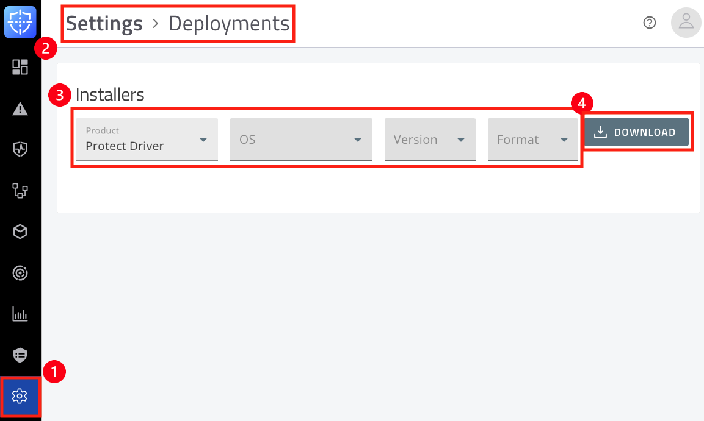

# Linux 에이전트 설치 
---

## 1. Linux Kernel과 에이전트 버전 호환성
### 1) 커널 버전 확인
-  <span class = "text-red">*`uname -r`*</span> 명령어를 실행하여 커널 버전을 확인하십시오.
    ```js
    [root@localhost Cylance]$ uname -r
    3.10.0-1160.el7.x86_64
    ```
- CylancePROTECTDriver 패키지의 'uname_matched_kernel_src' 파일을 열어 현재 커널 버전이 포함되어 있는지 확인하십시오.
<br />
<br />

## 2. Linux 최소 하드웨어 요구 사항
| OS    | 필요 요구사항 |
|--------|---------------------------------------------------|
|    Linux    | • 2 GHz Dual-core CPU <br />• 4 GB RAM  <br /> • 2GB 이상의 DISK 여유 공간 |
<br />
<br />

## 3. RPM 또는 DPKG를 사용한 Linux Agent 설치
### 1) 설치 패키지 다운로드
- **에이전트 Protect 패키지 다운로드**
  - **➊Settings**  > **➋ Deployments** > **➌ Installers[Protect 선택]** > **➍ Download**<br /><br />

&nbsp;
- **에이전트 드라이버 다운로드**
  - **➊Settings**  > **➋ Deployments** > **➌ Installers[Protect Driver 선택]** > **➍ Download**<br />
<br />

&nbsp;
### 2) 인스톨 토큰 값 설정
- /opt/cylance 디렉토리와 기본 설정 파일을 생성하십시오.
- <span class = "text-red">*`mkdir -p /opt/cylance`*</span>
- <span class = "text-red">*`touch /opt/cylance/config_defaults.txt >> /opt/cylance/config_defaults.txt`*</span>
    ```js
    [root@localhost Cylance]$ mkdir -p /opt/cylance
    [root@localhost Cylance]$ touch /opt/cylance/config_defaults.txt >> /opt/cylance/config_defaults.txt
    ```
<br />
- 토큰 값을 확인하십시오.
    - **➊Settings**  > **➋ Application** > **➌ Installation Token**<br />
<br />
- 가져온 토큰 값을 입력하십시오.
    &nbsp;
        ```js
        echo "InstallToken=<token_value>"
        [root@localhost Cylance]$ echo "InstallToken=3lOO9SL7FRTgHyAAfebkc8A"
        ```
<br />
<br />

### 3) CylancePROTECT 설치
:::tip 주의
- 에이전트 버전과 커널 버전 호환성을 꼭 확인하십시오.
- 설치 순서는 OpenDriver > Driver > Protect 입니다.
:::

&nbsp;
- #### RPM
    - **CylancePROTECTOpenDriver 설치**
    - <span class = "text-red">*`rpm -ivh CylanceProtectOpenDriver-3.0.xxxx-xx.elx.x86.rpm`*</span> 을 실행하여 오픈 드라이버를 설치합니다.
         ```js
          [root@localhost Cylance]$ sudo rpm -ivh CylancePROTECTOpenDriver-3.2.1101-743.el7.x86_64.rpm 
          경고: CylancePROTECTOpenDriver-3.2.1101-743.el7.x86_64.rpm: Header V4 RSA/SHA1 Signature, key ID eaedb194: NOKEY
          준비 중...                         ################################# [100%]
          Updating / installing...
            1:CylancePROTECTOpenDriver-3.2.1101################################# [100%]
          ```
    <br />

    &nbsp;
    - **CylancePROTECTDriver 설치**
    - <span class = "text-red">*`rpm -ivh CylanceProtectDriver-3.0.xxxx-xx.elx.x86.rpm`*</span> 을 실행하여 드라이버를 설치합니다.
         ```js
          [root@localhost Cylance]$ sudo rpm -ivh CylancePROTECTDriver-3.2.1101-743.el7.x86_64.rpm
          경고: CylancePROTECTDriver-3.2.1101-743.el7.x86_64.rpm: Header V4 RSA/SHA1 Signature, key ID eaedb194: NOKEY
          준비 중...                         ################################# [100%]
          Updating / installing...
            1:CylancePROTECTDriver-3.2.1101-743################################# [100%]
          ```
    <br />

    &nbsp;
    - **CylancePROTECT 에이전트 설치**
    - <span class = "text-red">*`rpm -ivh CylanceProtect.elx.rpm`*</span> 을 실행합니다.
         ```js
          [root@localhost Cylance]$ sudo rpm -ivh CylancePROTECT.el7.rpm
          준비 중...                         ################################# [100%]
          Updating / installing...
            1:CylancePROTECT-3.3.1000-730      ################################# [100%]
          ```
    <br />

    &nbsp;
    - **에이전트 서비스 상태 확인**
    - <span class = "text-red">*`systemctl status cylancesvc.service`*</span> 를 실행하여 에이전트가 <span class = "text-red">*running*</span> 상태인지 확인합니다.
         ```js
          [root@localhost Cylance]$ sudo systemctl status cylancesvc.service
          ● cylancesvc.service - CylancePROTECT
            Loaded: loaded (/usr/lib/systemd/system/cylancesvc.service; enabled; vendor preset: disabled)
            Active: active (running) since 토 2025-02-05 18:59:07 KST; 31min ago
            Process: 12340 ExecStart=/opt/cylance/desktop/cylancesvc (code=exited, status=0/SUCCESS)
            Process: 12331 ExecStartPre=/usr/src/CyProtectDrv-1.2/loadmodule.sh (code=exited, status=0/SUCCESS)
            Main PID: 12343 (cylancesvc)
                 Tasks: 36
                Memory: 94.0M
                CGroup: /system.slice/cylancesvc.service
                        └─12343 /opt/cylance/desktop/cylancesvc

            4월 05 18:59:09 hostname.local cylancesvc[12343]: ServerImpl:ServerImpl: SetServerCallbackForCommand: com...91c0
            4월 05 18:59:09 hostname.local cylancesvc[12343]: ServerImpl:ServerImpl: SetServerCallbackForCommand: com...9280
            4월 05 18:59:09 hostname.local cylancesvc[12343]: ServerImpl:ServerImpl: SetServerCallbackForCommand: com...9340
            4월 05 18:59:09 hostname.local cylancesvc[12343]: ServerImpl:ServerImpl: SetServerCallbackForCommand: com...9400
            4월 05 18:59:09 hostname.local cylancesvc[12343]: ServerImpl:ServerImpl: SetServerCallbackForCommand: com...94c0
            4월 05 18:59:09 hostname.local cylancesvc[12343]: ServerImpl:ServerImpl: SetServerCallbackForCommand: com...9580
            4월 05 18:59:09 hostname.local cylancesvc[12343]: ServerImpl:ServerImpl: SetServerCallbackForCommand: com...9640
            4월 05 18:59:09 hostname.local cylancesvc[12343]: ServerImpl:ServerImpl: SetServerCallbackForCommand: com...9700
            4월 05 18:59:09 hostname.local cylancesvc[12343]: ServerImpl:ServerImpl: SetServerCallbackForCommand: com...97c0
            4월 05 18:59:09 hostname.local cylancesvc[12343]: ServerImpl:ServerImpl: SetServerCallbackForCommand: com...9880

            Hint: Some lines were ellipsized, use -l to show in full.
            ```
    <br />

    &nbsp;
    - **에이전트 패키지 설치 확인**
    - <span class = "text-red">*`rpm -qa | grep Cylance`*</span> 를 실행하여 패키지가 정상적으로 설치되었는지 확인합니다.
         ```js
          [root@localhost Cylance]$ rpm -qa | grep Cylance
          CylancePROTECT-3.3.1000-730.x86_64
          CylancePROTECTOpenDriver-3.2.1101-743.el7.x86_64
          CylancePROTECTDriver-3.2.1101-743.el7.x86_64
          ```
    <br />

    &nbsp;
    - **에이전트 콘솔 연결 상태 확인**
    - <span class = "text-red">*`netstat -antp | grep cylance`*</span> 를 실행하여 에이전트가 콘솔과 정상적으로 연결되어 있는지 확인합니다.
         ```js
          [root@localhost Cylance]$ sudo netstat -antp | grep cylance
          tcp        0      0 192.168.1.10:40001     203.0.113.10:443      ESTABLISHED  12345/cylancesvc
          tcp        0      0 192.168.1.10:40002     198.51.100.23:443     ESTABLISHED  12345/cylancesvc
          tcp        0      0 192.168.1.10:40003     198.51.100.23:443     ESTABLISHED  12345/cylancesvc
          tcp        0      0 192.168.1.10:40004     192.0.2.44:443        ESTABLISHED  12345/cylancesvc
          ```
    <br />

    &nbsp;
    - **에이전트 등록 및 정책 상태 확인**
    - <span class = "text-red">*`/opt/cylance/desktop/cylance -s`*</span> 를 실행하여 정책 등록이 성공적인지 확인합니다.
         ```js
          [root@localhost Cylance]$ /opt/cylance/desktop/cylance -s
          Registration Status:   Registered
          Serial Number:         12345678-aaaa-bbbb-cccc-123456789abc
          Policy:                Default (Online)
          ```
    <br />
&nbsp;

- #### DEB
    - **CylancePROTECTOpenDriver 설치**
    - <span class = "text-red">*`dpkg -i cylance-protect-open-driver_3.0.xxxx.xxxx.deb`*</span> 을 실행하여 오픈 드라이버를 설치합니다.
         ```js
          [root@localhost Cylance]$ sudo dpkg -i cylance-protect-open-driver_3.2.1101.2995_amd64.deb
          경고: CylancePROTECTOpenDriver-3.2.1101-743.el7.x86_64.rpm: Header V4 RSA/SHA1 Signature, key ID eaedb194: NOKEY
          준비 중...                         ################################# [100%]
          Updating / installing...
            1:CylancePROTECTOpenDriver-3.2.1101################################# [100%]
          ```
    <br />

    &nbsp;
    - **CylancePROTECTDriver 설치**
    - <span class = "text-red">*`dpkg -i cylance-protect-driver_3.0.xxxx.xxxx.deb`*</span> 을 실행하여 드라이버를 설치합니다.
         ```js
          [root@localhost Cylance]$ sudo dpkg -i cylance-protect-driver_3.2.1101.2995_amd64.deb
          경고: CylancePROTECTDriver-3.2.1101-743.el7.x86_64.rpm: Header V4 RSA/SHA1 Signature, key ID eaedb194: NOKEY
          준비 중...                         ################################# [100%]
          Updating / installing...
            1:CylancePROTECTDriver-3.2.1101-743################################# [100%]
          ```
    <br />

    &nbsp;
    - **CylancePROTECT 에이전트 설치**
    - <span class = "text-red">*`dpkg -i cylance-protect.xxxx.x86_64.deb`*</span> 을 실행합니다.
         ```js
          [root@localhost Cylance]$ sudo dpkg -i cylance-protect.2004.x86_64.deb
          준비 중...                         ################################# [100%]
          Updating / installing...
            1:CylancePROTECT-3.3.1000-730      ################################# [100%]
          ```
    <br />

    &nbsp;
    - **에이전트 서비스 상태 확인**
    - <span class = "text-red">*`systemctl status cylancesvc.service`*</span> 를 실행하여 에이전트가 <span class = "text-red">*running*</span> 상태인지 확인합니다.
         ```js
          [root@localhost Cylance]$ sudo systemctl status cylancesvc.service
          ● cylancesvc.service - CylancePROTECT
            Loaded: loaded (/usr/lib/systemd/system/cylancesvc.service; enabled; vendor preset: disabled)
            Active: active (running) since 토 2025-02-05 18:59:07 KST; 31min ago
            Process: 12340 ExecStart=/opt/cylance/desktop/cylancesvc (code=exited, status=0/SUCCESS)
            Process: 12331 ExecStartPre=/usr/src/CyProtectDrv-1.2/loadmodule.sh (code=exited, status=0/SUCCESS)
            Main PID: 12343 (cylancesvc)
                 Tasks: 36
                Memory: 94.0M
                CGroup: /system.slice/cylancesvc.service
                        └─12343 /opt/cylance/desktop/cylancesvc

            4월 05 18:59:09 hostname.local cylancesvc[12343]: ServerImpl:ServerImpl: SetServerCallbackForCommand: com...91c0
            4월 05 18:59:09 hostname.local cylancesvc[12343]: ServerImpl:ServerImpl: SetServerCallbackForCommand: com...9280
            4월 05 18:59:09 hostname.local cylancesvc[12343]: ServerImpl:ServerImpl: SetServerCallbackForCommand: com...9340
            4월 05 18:59:09 hostname.local cylancesvc[12343]: ServerImpl:ServerImpl: SetServerCallbackForCommand: com...9400
            4월 05 18:59:09 hostname.local cylancesvc[12343]: ServerImpl:ServerImpl: SetServerCallbackForCommand: com...94c0
            4월 05 18:59:09 hostname.local cylancesvc[12343]: ServerImpl:ServerImpl: SetServerCallbackForCommand: com...9580
            4월 05 18:59:09 hostname.local cylancesvc[12343]: ServerImpl:ServerImpl: SetServerCallbackForCommand: com...9640
            4월 05 18:59:09 hostname.local cylancesvc[12343]: ServerImpl:ServerImpl: SetServerCallbackForCommand: com...9700
            4월 05 18:59:09 hostname.local cylancesvc[12343]: ServerImpl:ServerImpl: SetServerCallbackForCommand: com...97c0
            4월 05 18:59:09 hostname.local cylancesvc[12343]: ServerImpl:ServerImpl: SetServerCallbackForCommand: com...9880

            Hint: Some lines were ellipsized, use -l to show in full.
            ```
    <br />

    &nbsp;
    - **에이전트 패키지 설치 확인**
    - <span class = "text-red">*`dpkg -l | grep cylance`*</span> 를 실행하여 패키지가 정상적으로 설치되었는지 확인합니다.
         ```js
          [root@localhost:~/Cylance]$ sudo dpkg -l | grep cylance
          ii  cylance-protect                   3.3.1000.2530   amd64   Monitors for advanced security threats for your computer.
          ii  cylance-protect-driver:amd64     3.2.1101.2995   amd64   Monitors for advanced security threats for your computer
          ii  cylance-protect-open-driver:amd64 3.2.1101.2995  amd64   Monitors for advanced security threats for your computer
          ```
    <br />

    &nbsp;
    - **에이전트 콘솔 연결 상태 확인**
    - <span class = "text-red">*`netstat -antp | grep cylance`*</span> 를 실행하여 에이전트가 콘솔과 정상적으로 연결되어 있는지 확인합니다.
         ```js
          [root@localhost Cylance]$ sudo netstat -antp | grep cylance
          tcp        0      0 172.16.246.6:58918      34.192.94.89:443        ESTABLISHED 18439/cylancesvc    
          tcp        0      0 172.16.246.6:49584      13.55.238.162:443       ESTABLISHED 18439/cylancesvc
          ```
    <br />

    &nbsp;
    - **에이전트 등록 및 정책 상태 확인**
    - <span class = "text-red">*`/opt/cylance/desktop/cylance -s`*</span> 를 실행하여 정책 등록이 성공적인지 확인합니다.
         ```js
          [root@localhost Cylance]$ /opt/cylance/desktop/cylance -s
          Registration Status:   Registered
          Serial Number:         12345678-aaaa-bbbb-cccc-123456789abc
          Policy:                Default (Online)
          ```
    <br />
---