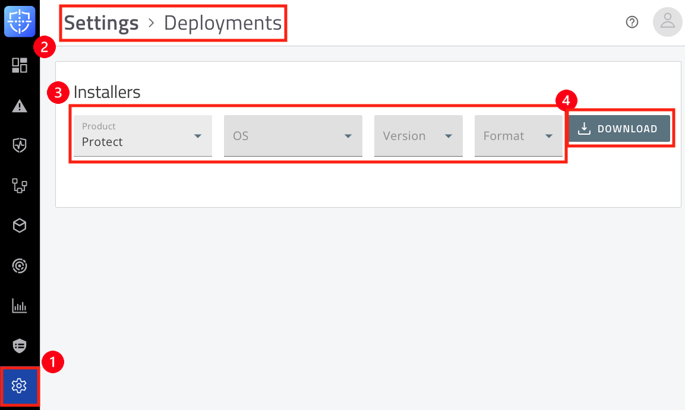
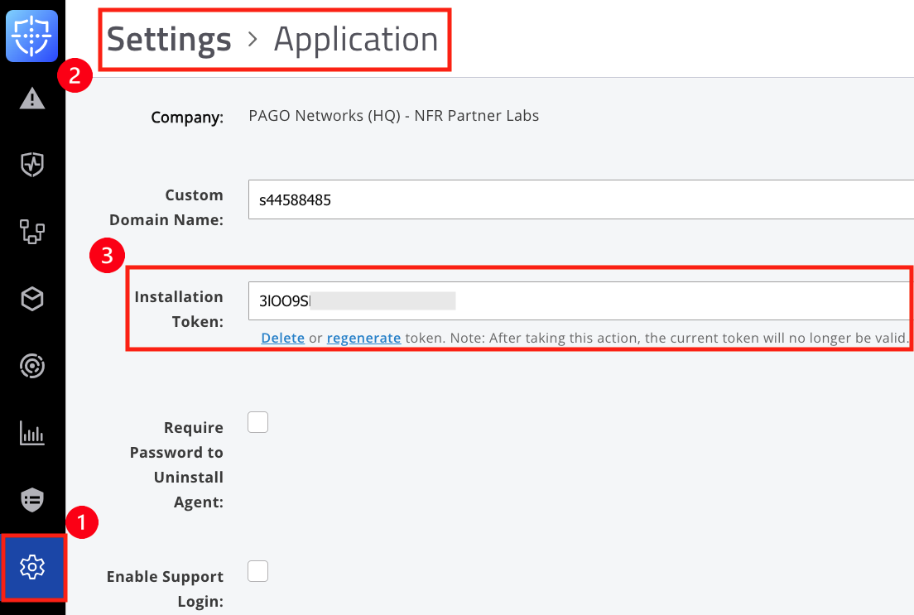
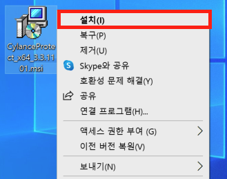
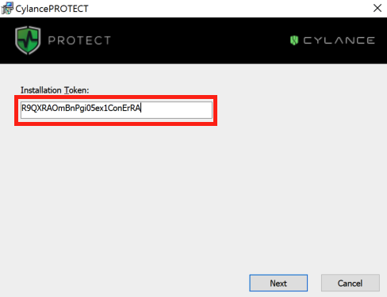
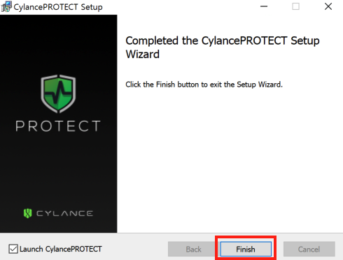
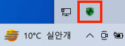
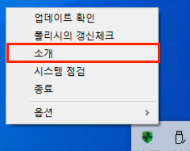

# Windows Agent 설치
---

## 1. Windows 시스템 요구 사항
| Windows OS                     | Architecture | Agent Version            | Note                                                                                   |
|-------------------------------|--------------|---------------------------|----------------------------------------------------------------------------------------|
| Windows 11                    | 32/64bit     | 에이전트 버전 1578 이상     |                                                                                        |
| Windows 10                    | 32/64bit     |                           | Enterprise, Pro, Home 지원                                                             |
| Windows 8 / 8.1               | 32/64bit     | 에이전트 버전 1564 까지     | Windows 8 Embedded 지원 Windows RT 미지원                                          |
| Windows 7                     | 32/64bit     | 에이전트 버전 1450 이상     | Embedded Standard 7, POSReady 7 지원                                                  |
| Windows POSReady              | 32/64bit     | 에이전트 버전 1450 이상     |                                                                                        |
| Windows Vista                 | 32/64bit     | 에이전트 버전 1564 까지     |                                                                                        |
| Windows XP SP3                | 32/64bit     | 에이전트 버전 1564 까지     | KB968730 또는 KB2868626 핫픽스 필요 .NET 4.0 이상 레지스트리 수정 인증서 설치 **재부팅 필요** |
| Windows Server 2022          | 64bit        | 에이전트 버전 1578 이상     | Storage Server 2022 미지원 Standard, Data Center, Core 지원                        |
| Windows Server 2019          | 64bit        | 에이전트 버전 1510 이상     | Storage Server 2019 미지원 Standard, Data Center, Core 지원                        |
| Windows Server 2016          | 64bit        | 에이전트 버전 1410 이상     | Nano, Storage Server 2016 미지원 Standard, Data Center, Essentials, Core 지원      |
| Windows Server 2012 / 2012 R2| 64bit        | 에이전트 버전 1450 이상     | Minimal Server Interface 미지원 Storage Server 2012 미지원                         |
| Windows Server 2008 / 2008 R2| 32/64bit     | 에이전트 버전 1564 까지     | Foundation 에디션은 1540 이상 필요 Core 에디션 미지원                              |
| Windows Server 2003 SP2 / 2003 R2 | 32/64bit | 에이전트 버전 1564 까지     | KB968730 또는 KB2868626 핫픽스 필요 .NET 4.0 이상 레지스트리 수정 인증서 설치 **재부팅 필요** |
| Windows Server 2019 Data Center | 64bit     | 에이전트 버전 1530 이상     | Nano 미지원 Hyper-V Server Role (Shielded VMs) 미지원 SDN, S2D 미지원          |
 
 

## 2. Windows 하드웨어 요구 사항
| 항목             | 권장 사양 / 조건                                                                                      |
|------------------|------------------------------------------------------------------------------------------------------|
| **메모리**        | 2GB 이상                                                                                             |
| **디스크 여유 공간** | 500MB 이상                                                                                           |
| **기타**          | Windows XP / Windows Server 2003의 경우:  - KB968730 또는 KB2868626 핫픽스 미설치 시 통신 문제 발생 가능  - SHA-256 기반 CA 인증서로 인해 통신 문제 발생 가능성 있음 (핫픽스 및 인증서 제공)  Agent 버전 1420 이상에서 TLS 1.2 지원  .NET Framework 3.5(SP1) 이상 필요 |
 
 

## 3. Windows 에이전트 설치

<>

  

    <iframe
      loading="lazy"
      className="sl-demo"
      src="https://app.storylane.io/demo/8eilppvwyiog?embed=inline"
      name="sl-embed"
      allow="fullscreen"
      allowFullScreen
      style={{
        position: 'absolute',
        top: 0,
        left: 0,
        width: '100%',
        height: '100%',
        border: '1px solid rgba(63,95,172,0.35)',
        boxShadow: '0px 0px 18px rgba(26, 19, 72, 0.15)',
        borderRadius: '10px',
        boxSizing: 'border-box',
      }}
    />
  

</>

### 1) 에이전트 설치 파일 다운로드
- **➊Settings**  > **➋ Deployments** > **➌ Installers[Protect 선택]** > **➍ Download**  

&nbsp;
### 2) 설치 토큰 값 확인
- **➊Settings**  > **➋ Application** > **➌ Installation Token**  

&nbsp;
### 3) MSI 파일 설치
- **➊ CylacnePROTECT.msi** > **➋ 마우스 우클릭** > **➌ 설치**   

&nbsp;
- **➊ Site Token 입력** > **➋ Next** 

&nbsp;
- **Finish**클릭 

&nbsp;
### 4) 에이전트 설치 상태 확인
- 오른쪽 하단의 **CylancePROTECT 에이전트 트레이 아이콘** 확인  
&nbsp;
- **CylancePROTECT 아이콘** 우클릭 > **소개** 클릭  
&nbsp;
- 소개 팝업창에서 정보 확인
   - 정책
   - Online 상태
   - 폴리시의 최종 갱신 일시
   - 일련번호 

 

---