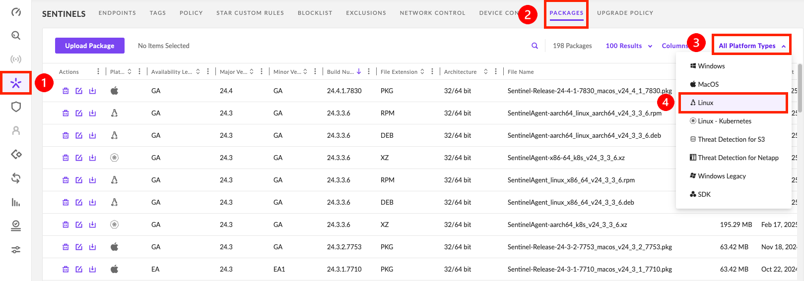
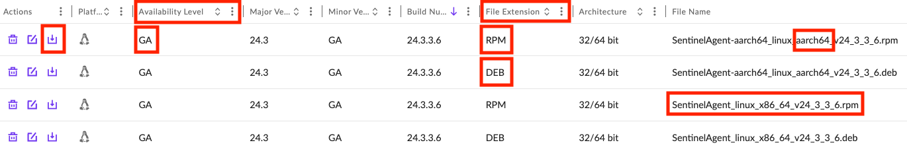

# Linux 에이전트 설치 
---

## 1. Linux 에이전트 요구 사항

> <br />Linux Agent는 Kubernetes(K8s) 플랫폼에서 지원되지 않습니다. <br /><br />

### 1) 리눅스 CentOS, RHEL, Azure
| **리눅스 배포판 및 버전**  | **24.3** | **24.2** | **24.1**  | **23.4**  | **23.3**  |  **23.2** | **23.1**  | **22.4** |  **22.3** |
|-------------------------------|:--------:|:--------:|:--------:|:--------:|:--------:|:--------:|:--------:|:--------:|:--------:|
| AlmaLinux 9.5                 |    O     |    O     |    O     |    X     |    X     |    X     |    X     |    X     |    X     |
| AlmaLinux 9.4                 |    O     |    O     |    O     |    X     |    X     |    X     |    X     |    X     |    X     |
| AlmaLinux 9.3, 9.2            |    O     |    O     |    O     |    O     |    O     |    X     |    X     |    X     |    X     |
| AlmaLinux 8.10                |    O     |    O     |    O     |    X     |    X     |    X     |    X     |    X     |    X     |
| AlmaLinux 8.8                 |    O     |    O     |    O     |    O     |    O     |    O     |    O     |    X     |    X     |
| AlmaLinux 9.1, 9.0, 8.7, <br /> 8.6, 8.5, 8.4 |    O     |    O     |    O     |    O     |    O     |    O     |    O     |    O     |    O     |
| Amazon Linux 2023.6, 2023.5   |    O     |    O     |    O     |    X     |    X     |    X     |    X     |    X     |    X     |
| Amazon Linux 2023.3           |    O     |    O     |    O     |    O     |    O     |    O     |    X     |    X     |    X     |
| Amazon Linux 2023.1, 2023     |    O     |    O     |    O     |    O     |    O     |    O     |    O     |    X     |    X     |
| Amazon Linux 2, AMI 2018, <br /> AMI 2017 |    O     |    O     |    O     |    O     |    O     |    O     |    O     |    O     |    O     |
| Azure Linux (formerly CBL-<br /> Mariner) |    O     |    O     |    O     |    O     |    O     |    X     |    X     |    X     |    X     |
| CentOS 8.4 - 8.0, 7.9 - 7.0, <br /> 6.10 - 6.4 |    O     |    O     |    O     |    O     |    O     |    O     |    O     |    O     |    O     |
| Centos Stream v9              |    O     |    O     |    O     |    O     |    O     |    X     |    X     |    X     |    X     |
| Red Hat Enterprise Linux <br />(RHEL) 9.5 |    O     |    O     |    O     |    X     |    X     |    X     |    X     |    X     |    X     |
| Red Hat Enterprise Linux <br />(RHEL) 9.4 |    O     |    O     |    O     |    X     |    X     |    X     |    X     |    X     |    X     |
| Red Hat Enterprise Linux <br />(RHEL) 9.3, 9.2, 8.9 |    O     |    O     |    O     |    O     |    O     |    X     |    X     |    X     |    X     |
| Red Hat Enterprise Linux <br />(RHEL) 8.10 |    O     |    O     |    O     |    X     |    X     |    X     |    X     |    X     |    X     |
| Red Hat Enterprise Linux <br />(RHEL) 8.8 |    O     |    O     |    O     |    O     |    O     |    O     |    O     |    X     |    X     |
| Red Hat Enterprise Linux <br />(RHEL) 9.1, 9.0, 8.7-8.0, <br />7.9-7.0, 6.10-6.4 |    O     |    O     |    O     |    O     |    O     |    O     |    O     |    O     |    O     |
| Rocky Linux 9.5               |    O     |    O     |    O     |    X     |    X     |    X     |    X     |    X     |    X     |
| Rocky Linux 9.4               |    O     |    O     |    O     |    X     |    X     |    X     |    X     |    X     |    X     |
| Rocky Linux 9.3, 9.2          |    O     |    O     |    O     |    O     |    O     |    X     |    X     |    X     |    X     |
| Rocky Linux 8.10              |    O     |    O     |    O     |    X     |    X     |    X     |    X     |    X     |    X     |
| Rocky Linux 8.8               |    O     |    O     |    O     |    O     |    O     |    O     |    O     |    X     |    X     |
| Rocky Linux 9.1, 9.0, 8.7, 8.6, 8.5, 8.4 |    O     |    O     |    O     |    O     |    O     |    O     |    O     |    O     |    O     |
<br />

### 2) 리눅스 Debian, Ubuntu, SUSE
| **리눅스 배포판 및 버전**  | **24.3** | **24.2** | **24.1**  | **23.4**  | **23.3**  |  **23.2** | **23.1**  | **22.4** |  **22.3** |
|-------------------------------|:--------:|:--------:|:--------:|:--------:|:--------:|:--------:|:--------:|:--------:|:--------:|
| Debian 12.8, 12.7, 12.6        |    O     |    O     |    O     |    O     |    X     |    X     |    X     |    X     |    X     |
| Debian 12.5                    |    O     |    O     |    O     |    O     |    X     |    X     |    X     |    X     |    X     |
| Debian 12.4                    |    O     |    O     |    O     |    O     |    O     |    X     |    X     |    X     |    X     |
| Debian 12.2, 12.1, 12          |    O     |    O     |    O     |    O     |    O     |    X     |    X     |    X     |    X     |
| Debian 11.9                    |    O     |    O     |    O     |    O     |    X     |    X     |    X     |    X     |    X     |
| Debian 11.8, 11.7, 10.13       |    O     |    O     |    O     |    O     |    O     |    O     |    X     |    X     |    X     |
| Debian 11.11, 11.10            |    O     |    O     |    O     |    O     |    O     |    O     |    O     |    O     |    O     |
| Debian 11, 10, 9, 8            |    O     |    O     |    O     |    O     |    O     |    X     |    X     |    X     |    X     |
| Ubuntu 24.04, 22.04.5          |    O     |    X     |    X     |    X     |    X     |    X     |    X     |    X     |    X     |
| Ubuntu 20.04.6                 |    O     |    O     |    O     |    O     |    O     |    O     |    X     |    X     |    X     |
| Ubuntu 22.04, 20.04, 18.04, 16.04, 14.04 |    O     |    O     |    O     |    O     |    O     |    O     |    O     |    O     |    O     |
| SUSE Linux Enterprise Server 15 sp6 |    O     |    X     |    X     |    X     |    X     |    X     |    X     |    X     |    X     |
| SUSE Linux Enterprise Server 15 sp5 |    O     |    O     |    O     |    O     |    O     |    O     |    O     |    O     |    X     |
| SUSE Linux Enterprise Server 11 sp4 |    O     |    O     |    X     |    X     |    X     |    X     |    X     |    X     |    X     |
| SUSE Linux Enterprise Server 15.x, 12.x |    O     |    O     |    O     |    X     |    X     |    X     |    X     |    X     |    X     |
| Scientific Linux 7, 6          |    O     |    O     |    O     |    O     |    O     |    O     |    O     |    O     |    O     |
| Virtuozzo 7                    |    O     |    O     |    O     |    O     |    O     |    O     |    O     |    O     |    O     |
<br />

### 3) 리눅스 Oracle and Fedora
| **리눅스 배포판 및 버전**  | **24.3** | **24.2** | **24.1**  | **23.4**  | **23.3**  |  **23.2** | **23.1**  | **22.4** |  **22.3** |
|-------------------------------|:--------:|:--------:|:--------:|:--------:|:--------:|:--------:|:--------:|:--------:|:--------:|
| CloudLinux Shared v8, v6*      |    O     |    O     |    O     |    O     |    O     |    O     |    X     |    X     |    X     |
| Fedora 40                      |    O     |    O     |    O     |    O     |    O     |    O     |    X     |    X     |    X     |
| Fedora 39, 38                  |    O     |    X     |    X     |    X     |    X     |    X     |    X     |    X     |    X     |
| Fedora 37, 36, 35              |    O     |    O     |    O     |    O     |    O     |    O     |    O     |    O     |    O     |
| Oracle 9.5                      |    O     |    O     |    O     |    X     |    X     |    X     |    X     |    X     |    X     |
| Oracle 9.3, 9.2, 8.9           |    O     |    O     |    O     |    O     |    O     |    X     |    X     |    X     |    X     |
| Oracle 9.1, 8.8                |    O     |    O     |    O     |    O     |    O     |    O     |    O     |    X     |    X     |
| Oracle 8.10                    |    O     |    O     |    O     |    X     |    X     |    X     |    X     |    X     |    X     |
| Oracle 9.0, 8.7-8.0, 7.9 - 7.0, 6.10, 6.9 |    O     |    O     |    O     |    O     |    O     |    O     |    O     |    O     |    O     |

***참고***: *CloudLinux Shared 지원에는 하이브리드 및 비하이브리드 커널이 포함됩니다. 단, 컨테이너는 지원되지 않습니다.*
<br />

### 4) 리눅스 ARM 
- Linux ARM Agent 설치 방식은 x86 환경에서의 Linux Agent와 동일하지만, 올바른 설치 프로그램을 사용해야 합니다. 
  - x86 패키지는 ARM 엔드포인트에 설치할 수 없습니다.
  - ARM 패키지는 x86 엔드포인트에 설치할 수 없습니다.
- AWS GovCloud 환경은 지원되지 않습니다.<br />

| **리눅스 배포판 및 버전**  | **24.3** | **24.2** | **24.1**  | **23.4**  | **23.3**  |  **23.2** | **23.1**  | **22.4** |  **22.3** |
|-------------------------------|:--------:|:--------:|:--------:|:--------:|:--------:|:--------:|:--------:|:--------:|:--------:|
| AlmaLinux 8.10                 |    O     |    O     |    O     |    O     |    O     |    O     |    X     |    X     |    X     |
| AlmaLinux 8.8                  |    O     |    O     |    O     |    O     |    O     |    O     |    X     |    X     |    X     |
| AlmaLinux 9.1, 9.0, 8.7, 8.6  |    O     |    O     |    O     |    O     |    O     |    O     |    O     |    O     |    O     |
| Alma Linux 9.3, 9.2            |    O     |    O     |    O     |    O     |    O     |    X     |    X     |    X     |    X     |
| AlmaLinux 9.4                  |    O     |    O     |    O     |    X     |    X     |    X     |    X     |    X     |    X     |
| AlmaLinux 9.5                  |    O     |    O     |    O     |    X     |    X     |    X     |    X     |    X     |    X     |
| Amazon Linux 2                 |    O     |    O     |    O     |    O     |    O     |    O     |    O     |    O     |    O     |
| Amazon Linux 2023.1, 2023      |    O     |    O     |    O     |    O     |    O     |    O     |    O     |    O     |    X     |
| Amazon Linux 2023.3            |    O     |    O     |    O     |    O     |    O     |    O     |    X     |    X     |    X     |
| Amazon Linux 2023.6, 2023.5    |    O     |    O     |    O     |    X     |    X     |    X     |    X     |    X     |    X     |
| Debian 11, 10                  |    O     |    O     |    O     |    O     |    O     |    O     |    O     |    O     |    O     |
| Debian 11.11, 11.10            |    O     |    O     |    O     |    X     |    X     |    X     |    X     |    X     |    X     |
| Debian 11.8, 11.7, 10.13       |    O     |    O     |    O     |    O     |    O     |    O     |    X     |    X     |    X     |
| Debian 11.9                    |    O     |    O     |    O     |    O     |    X     |    X     |    X     |    X     |    X     |
| Debian 12.2, 12.1, 12          |    O     |    O     |    O     |    O     |    O     |    X     |    X     |    X     |    X     |
| Debian 12.4                    |    O     |    O     |    O     |    O     |    O     |    O     |    X     |    X     |    X     |
| Debian 12.5                    |    O     |    O     |    O     |    O     |    X     |    X     |    X     |    X     |    X     |
| Debian 12.8, 12.7, 12.6        |    O     |    O     |    O     |    X     |    X     |    X     |    X     |    X     |    X     |
| RHEL 8.10                      |    O     |    O     |    O     |    X     |    X     |    X     |    X     |    X     |    X     |
| RHEL 8.8                       |    O     |    O     |    O     |    O     |    O     |    O     |    O     |    X     |    X     |
| RHEL 9.1, 9.0, 8.4 - 8.7       |    O     |    O     |    O     |    O     |    O     |    O     |    O     |    O     |    O     |
| RHEL 9.3, 9.2, 8.9             |    O     |    O     |    O     |    O     |    O     |    X     |    X     |    X     |    X     |
| RHEL 9.4                       |    O     |    O     |    O     |    X     |    X     |    X     |    X     |    X     |    X     |
| RHEL 9.5                       |    O     |    O     |    O     |    X     |    X     |    X     |    X     |    X     |    X     |
| Rocky Linux 8.10               |    O     |    O     |    O     |    X     |    X     |    X     |    X     |    X     |    X     |
| Rocky Linux 8.8                |    O     |    O     |    O     |    O     |    O     |    O     |    O     |    X     |    X     |
| Rocky Linux 9.1, 9.0, 8.7, 8.6 |    O     |    O     |    O     |    O     |    O     |    O     |    O     |    O     |    O     |
| Rocky Linux 9.3, 9.2           |    O     |    O     |    O     |    O     |    O     |    X     |    X     |    X     |    X     |
| Rocky Linux 9.4                |    O     |    O     |    O     |    X     |    X     |    X     |    X     |    X     |    X     |
| Rocky Linux 9.5                |    O     |    O     |    O     |    X     |    X     |    X     |    X     |    X     |    X     |
| SUSE 15 sp5                    |    O     |    O     |    O     |    O     |    O     |    O     |    O     |    O     |    X     |
| SUSE 15 sp6                    |    O     |    X     |    X     |    X     |    X     |    X     |    X     |    X     |    X     |
| SUSE 15.x                      |    O     |    O     |    O     |    O     |    O     |    O     |    O     |    O     |    O     |
| Ubuntu 20.04.6                 |    O     |    O     |    O     |    O     |    O     |    O     |    X     |    X     |    X     |
| Ubuntu 22.04, 20.04, 18.04     |    O     |    O     |    O     |    O     |    O     |    O     |    O     |    O     |    O     |
| Ubuntu 24.04, 22.04.5          |    O     |    X     |    X     |    X     |    X     |    X     |

<br />
<br />

## 2. Linux 하드웨어 요구 사항
| 항목 | 요구 사항 |
|------|-----------|
| CPU | 2GHz 듀얼코어 (SSE4_2 지원 필요)<br />※ 일부 가상 환경에서는 고급 CPU 기능(SSE4_2 등)을 숨길 수 있으므로 VM 공급업체 문서를 참조해야 함:<br /> |
| 메모리 | 4 GB RAM (배포판 요구 사항에 따름) |
| 디스크 공간 | `/opt/sentinelone`에 2 GB 이상 사용 가능 공간 (3 GB 권장)<br />※ Linux 배포판의 최소 디스크 공간 및 파티션 요구 사항을 충족해야 함 |
<br />
<br />

## 3. RPM 또는 DPKG를 사용한 Linux Agent 설치

> <br />지원 버전: Linux Agent 3.0 이상<br /><br />

[👉 데모 보러가기](https://app.storylane.io/share/bzfyolv3shq8)

### 1) 에이전트 설치 파일 다운로드 

- **➊ Sentinels**  > **➋ PACKAGES** > **➌ All Platform Types** > **➍ Linux** <br />
<br /> 
  -  테스트를 거쳐 안정화된 최신 **GA** 버전을 다운로드하세요. 
  -  EA 버전은 테스트 전용 에이전트이며 예상치 못한 버그나 문제를 일으킬 수 있습니다.
  -  ARM CPU를 사용하는 경우 ARM64 파일을 다운로드하세요.
  <br />

### 2) 설치 과정
- **RPM**:
  - <span class = "text-red">*`sudo rpm -i --nodigest package_pathname`*</span> 을 실행합니다.<br />
    ```bash
    [root@localhost SentinelOne]$ sudo rpm -i --nodigest SentinelAgent_linux_x86_64_v24_3_3_6.rpm
    warning: SentinelAgent_linux_x86_64_v24_3_3_6.rpm: Header V4 RSA/SHA256 Signature, key ID bf000751: NOKEY
    ```

  &nbsp;
  - 그룹 또는 사이트 토큰을 사용하여 에이전트를 관리 콘솔과 연결합니다.<br /><span class = "text-red">*`sudo /opt/sentinelone/bin/sentinelctl management token set <site_token_value>`*</span> 을 실행합니다.<br />
    ```bash
    [root@localhost SentinelOne]$ sudo /opt/sentinelone/bin/sentinelctl management token set eyJ1cmwiOiAiaHR0cHM6Ly9hcHNlMS1wYWdvLnNlbnRpbmVsb25lLm5ldCIsICJzaXRlX2tleSI6ICIzNTY0MTE5MzU3YjU3NGE4In0= 
    Setting registration token...
    Registration token successfully set
    ```
    - **Sentinels** > **PACKAGES** or **SITE INFO** > ***stie_token_value*** 에서 사이트 토큰값을 가져옵니다.<br />


  &nbsp;
  - 에이전트 서비스를 시작합니다.<br />Run <span class = "text-red">*`sudo /opt/sentinelone/bin/sentinelctl control start`*</span> 을 실행합니다.<br />
    ```bash
    [root@localhost SentinelOne]$ sudo /opt/sentinelone/bin/sentinelctl control start
    Starting agent...
    Agent is running
    ```
    - 콘솔에서 에이전트 호스트명을 확인합니다.<br />&nbsp;


  &nbsp;
  - 몇 분이 지난 후, 에이전트 상태를 다시 확인합니다. 다른 소프트웨어가 에이전트 시작에 영향을 줄 수 있으므로, 상태가 정상적으로 표시되는지 확인하십시오.<br />Run <span class = "text-red">*`sudo /opt/sentinelone/bin/sentinelctl management status`*</span>.<br />
    ```js
    [root@localhost SentinelOne]$ sudo /opt/sentinelone/bin/sentinelctl management status
    Anti Tamper                      On
    AppInventory force update        86400
    AppInventory interval            600
    Connect through                  direct
    Connectivity                     On
    Customer id                      undefined
    Device type                      server
    Machine information interval     600
    Override DV proxy address        undefined
    Proxy address                    undefined
    Secured protocol mode            best_effort
    Site-Key                         03b40c38997920d2
    URL                              https://apse1-pago.sentinelone.net
    UUID                             <UUID_value>
    ```
  <br />
  <br />

- **DEB**:
    - <span class = "text-red">*`sudo dpkg -i package_pathname`*</span> 을 실행합니다.<br />
      ```js
      [root@localhost:~/SentinelOne]$ sudo dpkg -i SentinelAgent_linux_x86_64_v24_3_3_6.deb
      (Reading database ... 183344 files and directories currently installed.)
      Preparing to unpack SentinelAgent_Linux_x86_64_v24_3_3_6.deb ...
      Unpacking sentinelagent (24.3.3.6) over (24.3.1.29) ...
      Setting up sentinelagent (24.3.3.6) ...
      Starting agent...
      Agent is running
      Processing triggers for systemd (245.4-4ubuntu3.20) ...
      ```

    &nbsp;
    - 그룹 또는 사이트 토큰을 사용하여 에이전트를 관리 콘솔과 연결합니다.<br /><span class = "text-red">*`sudo /opt/sentinelone/bin/sentinelctl management`<br />`token set <site_token_value/group_token_value>`*</span> 을 실행합니다.<br />
      ```js
      [root@localhost:~/SentinelOne]$ sudo /opt/sentinelone/bin/sentinelctl management token set eyJ1cmwiOiAiaHR0cHM6Ly9hcHNlMS1wYWdvLnNlbnRpbmVsb25lLm5ldCIsICJzaXRlX2tleSI6ICIzNTY0MTE5MzU3YjU3NGE4In0= 
      Setting registration token...
      Registration token successfully set
      ```
  
    &nbsp;
    - 에이전트 서비스를 시작합니다.<br />Run <span class = "text-red">*`sudo /opt/sentinelone/bin/sentinelctl control start`*</span> 을 실행합니다.<br />
      ```bash
      [root@localhost:~/SentinelOne]$ sudo /opt/sentinelone/bin/sentinelctl control start
      Starting agent...
      Agent is running
      ```
      - 콘솔에서 에이전트 호스트명을 확인합니다.<br />

    &nbsp;
    - 몇 분이 지난 후, 에이전트 상태를 다시 확인합니다. 다른 소프트웨어가 에이전트 시작에 영향을 줄 수 있으므로, 상태가 정상적으로 표시되는지 확인하십시오.<br /><span class = "text-red">*`sudo /opt/sentinelone/bin/sentinelctl management status`*</span>.
      ```js
      [root@localhost SentinelOne]$ sudo /opt/sentinelone/bin/sentinelctl management status
      Anti Tamper                      On
      AppInventory force update        86400
      AppInventory interval            600
      Connect through                  direct
      Connectivity                     On
      Customer id                      undefined
      Device type                      server
      Machine information interval     600
      Override DV proxy address        undefined
      Proxy address                    undefined
      Secured protocol mode            best_effort
      Site-Key                         03b40c38997920d2
      URL                              https://apse1-pago.sentinelone.net
      UUID                             <UUID_value>
      ```
      <br />
---
<>

  <div
    style={{
      position: 'relative',
      paddingBottom: 'calc(33.16% + 25px)',
      width: '100%',
      height: 0,
      transform: 'scale(1)',
    }}
  >
    <iframe
      loading="lazy"
      className="sl-demo"
      src="https://app.storylane.io/demo/bzfyolv3shq8?embed=inline"
      name="sl-embed"
      allow="fullscreen"
      allowFullScreen
      style={{
        position: 'absolute',
        top: 0,
        left: 0,
        width: '100%',
        height: '100%',
        border: '1px solid rgba(63,95,172,0.35)',
        boxShadow: '0px 0px 18px rgba(26, 19, 72, 0.15)',
        borderRadius: '10px',
        boxSizing: 'border-box',
      }}
    />
  </div>

</>

