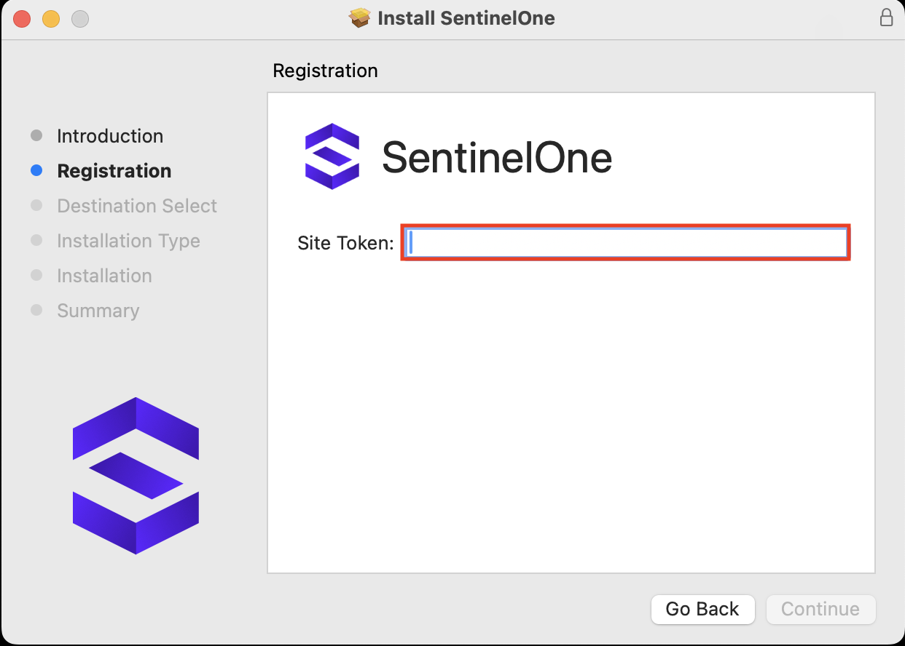
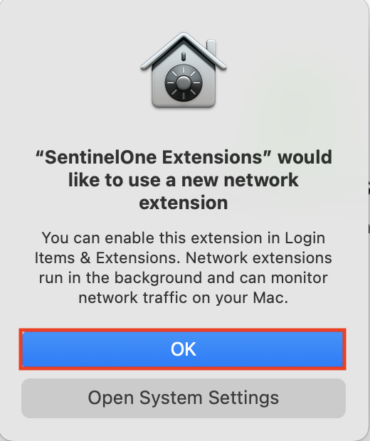
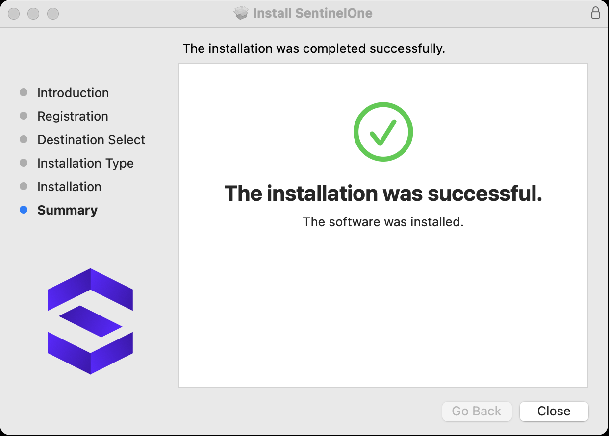
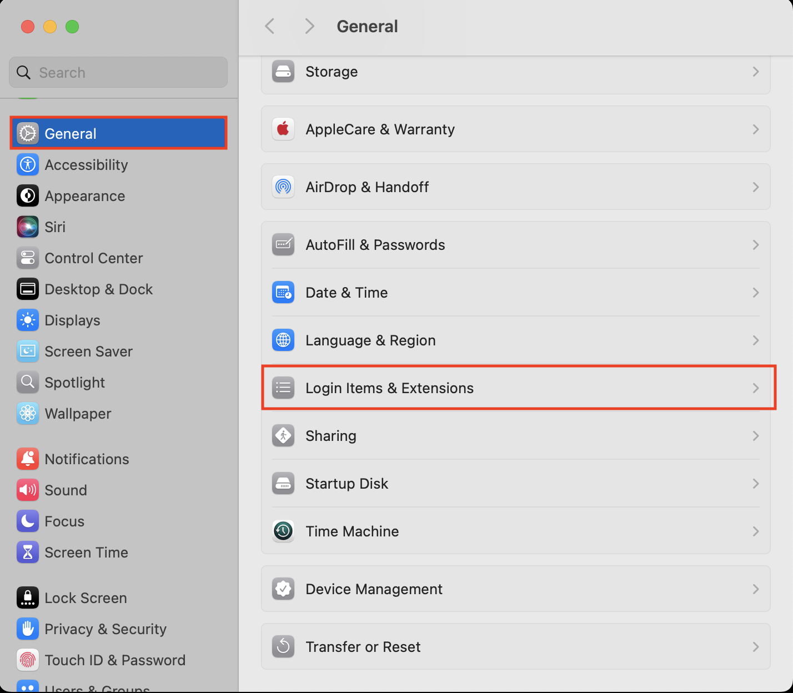
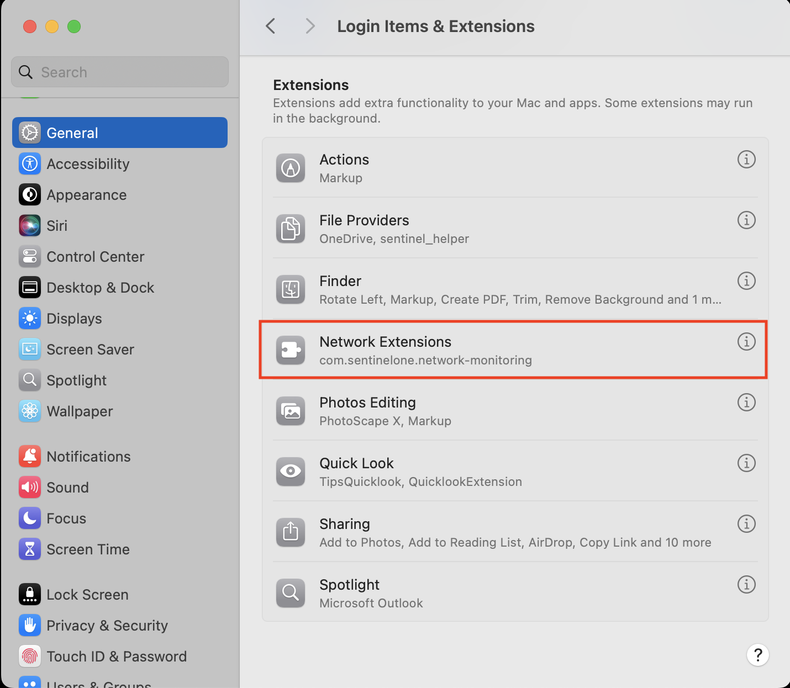
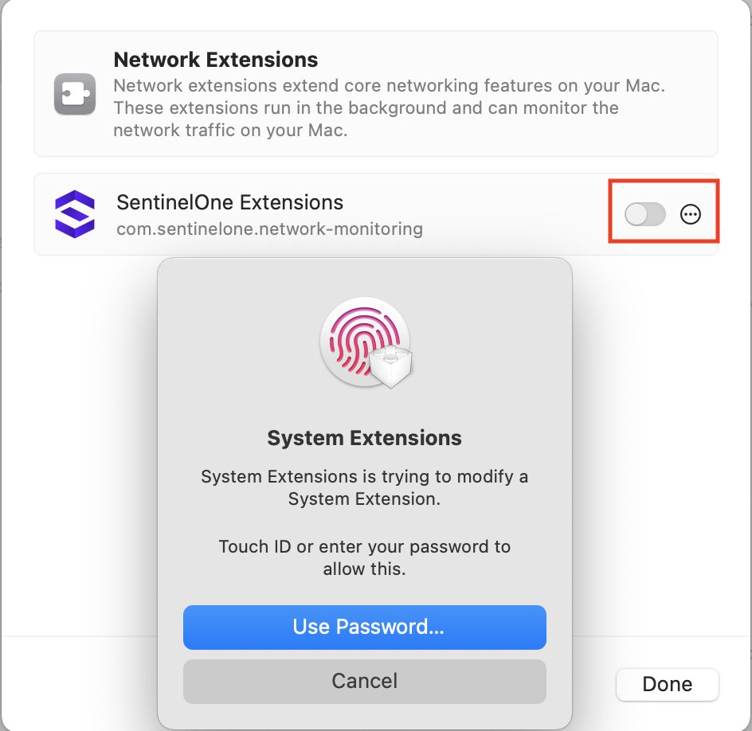
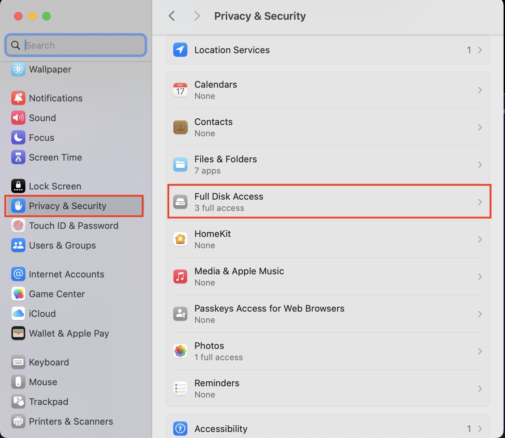
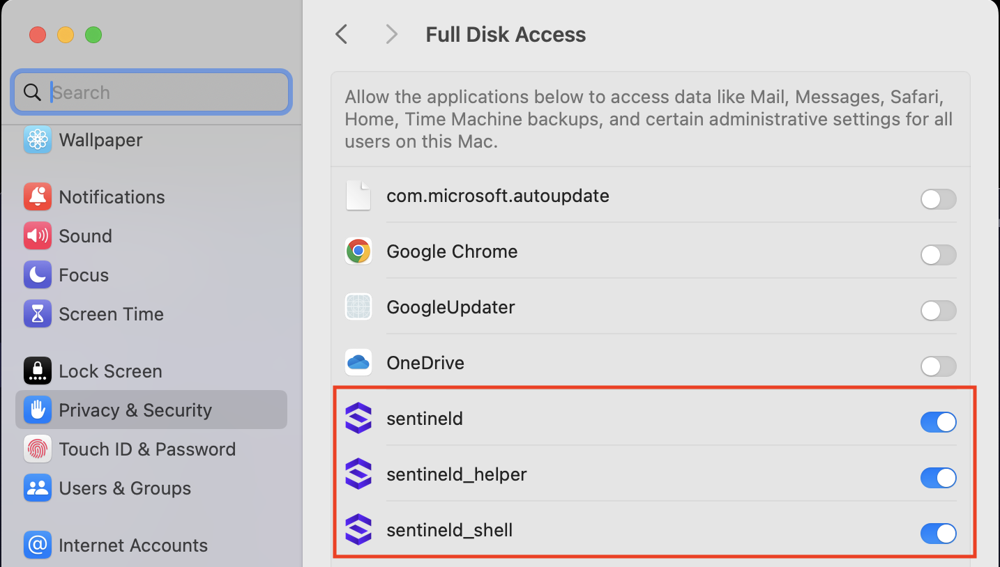
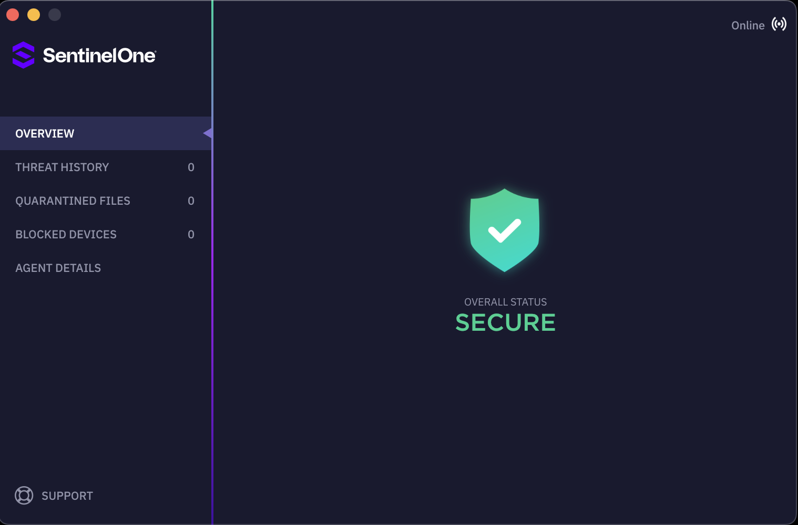

# macOS 에이전트 설치 
---
>  Apple은 개발자에게 출시 전 GA(일반 사용자 출시) 버전을 제공하지 않으며, 베타 버전(개발자와 공유됨)과 GA 버전 사이에 변경 사항이 있을 수 있습니다.  SentinelOne이 새로운 macOS 버전을 공식적으로 지원할 때까지 OS 업데이트를 중단할 것을 권장합니다.  Apple의 새로운 OS 및 하드웨어 출시에는 특정 요구 사항이 있을 수 있습니다. 이러한 출시로 인해 SentinelOne 솔루션의 특정 기능과 기능성에 영향을 미칠 수 있습니다.  

## 1. Apple 운영 체제 버전
<!-- macOS 버전별로 지원되는 SentinelOne 에이전트 목록입니다. -->
| **OS명**     | **OS 버전**          | **SentinelOne 에이전트 버전** | **24.4** | **24.3** | **24.2** | **24.1** | **23.4** | **23.3** | **23.2 (서비스 종료)** | **23.1 (서비스 종료)** |
|-----------------|-------------------------|------------------------------|----------|----------|----------|----------|----------|----------|----------------|----------------|
| **Sequoia**     | 15.3                    | | 24.4.1                       | 24.3.2   | 24.2.2   | 24.1.2   |         |         |         |               |               |
|                 | 15.0, 15.0.1, 15.1, 15.1.1, 15.2 | | 24.4.1 | 24.3.2 | 24.2.2 | 24.1.2 |  |  |  |  |
| **Sonoma**      | 14.7.4                  | | 24.4.1                       | 24.3.2   | 24.2.2   |        |         |        |         |            |              |
|                 | 14.7.2, 14.7.3          | | 24.4.1                       | 24.3.2   | 24.2.2   | 24.1.3   |        |         |        |              |              |
|                 | 14.7.1                  | | 24.4.1                       | 24.3.2   | 24.2.2   | 24.1.3   | 23.4.3+  |        |       |              |              |
|                 | 14.7                    | | 24.4.1                       | 24.3.2   | 24.2.2   | 24.1.3   | 23.4.3+  | 23.3.2+  |        |               |              |
|                 | 14.6.1                 |  | 24.4.1                       | 24.3.2   | 24.2.2   | 24.1.3   | 23.4.3+  | 23.3.2+  |       |              |              |
|                 | 14.6                    | | 24.4.1                       | 24.3.2   | 24.2.2   | 24.1.2+  | 23.4.1+  | 23.3.2+  |         |              |             |
|                 | 14.2, 14.2.1, 14.3, 14.3.1, 14.4, 14.4.1, 14.5 | | 24.4.1 | 24.3.2 | 24.2.2 | 24.1.1+ | 23.4.1+ | 23.3.2+ | 23.2.6+ |  |
|                 | 14.0, 14.1, 14.1.1, 14.1.2 | | 24.4.1 | 24.3.2 | 24.2.2 | 24.1.1+ | 23.4.1+ | 23.3.1+ | 23.2.2+ | 23.1.3+ |
| **Ventura**     | 13.7.4                  | | 24.4.1                       | 24.3.2   | 24.2.2   |        |         |         |        |               |              |
|                 | 13.7.2, 13.7.3          | |                            |         | 24.2.2   | 24.1.3   | 23.4.3   |         |        |              |               |
|                 | 13.7.1                  | | 24.4.1                       | 24.3.2   | 24.2.2   | 24.1.3   | 23.4.3+  |        |         |              |               |
|                 | 13.7                    | | 24.4.1                       | 24.3.2   | 24.2.2   | 24.1.3   | 23.4.3+  | 23.3.2+  |        |               |              |
|                 | 13.6.9                 |  | 24.4.1                       | 24.3.2   | 24.2.2   | 24.1.3   | 23.4.3+  | 23.3.2+  |         |              |               |
|                 | 13.6.8                 |  | 24.4.1                       | 24.3.2   | 24.2.2   | 24.1.3   | 23.4.1+  | 23.3.2+  |        |               |              |
|                 | 13.6.3, 13.6.4, 13.6.5, 13.6.6, 13.6.7 | | 24.4.1 | 24.3.2 | 24.2.2 | 24.1.1+ | 23.4.1+ | 23.3.2+ | 23.2.6+ |  |
|                 | 13.5.1, 13.6, 13.6.1     | | 24.4.1                       | 24.3.2   | 24.2.2   | 24.1.1+  | 23.4.1+  | 23.3.1+  | 23.2.1+  | 23.1.3+  |
|                 | 13.3, 13.3.1, 13.3.1(a), 13.4, 13.4.1, 13.5 | | 24.4.1 | 24.3.2 | 24.2.2 | 24.1.1+ | 23.4.1+ | 23.3.1+ | 23.2.1+ | 23.1.1+ |
|                 | 13.2, 13.2.1            | | 24.4.1                       | 24.3.2   | 24.2.2   | 24.1.1+  | 23.4.1+  | 23.3.1+  | 23.2.1+  | 23.1.1+  |
|                 | 13.0, 13.1             | | 24.4.1                       | 24.3.2   | 24.2.2   | 24.1.1+  | 23.4.1+  | 23.3.1+  | 23.2.1+  | 23.1.1+  |
| **Monterey**    | 12.7.6                  | |                            |   | 24.2.2   | 24.1.3   | 23.4.1+  | 23.3.2+  |   |              |
|                 | 12.7.2, 12.7.3, 12.7.4, 12.7.5 | |  |  | 24.2.2 | 24.1.1+ | 23.4.1+ | 23.3.2+ |  23.2.6+ |  |
|                 | 12.7.1        |           |                     |   | 24.2.2   | 24.1.1+  | 23.4.1+  | 23.3.2+  | 23.2.3+  | 23.1.3+ |
|                 | 12.7              |        |                  |   | 24.2.2   | 24.1.1+  | 23.4.1+  | 23.3.1+  | 23.2.1+  | 23.1.1+ |
|                 | 12.6.8           |       |                      |    | 24.2.2   | 24.1.1+  | 23.4.1+  | 23.3.1+  | 23.2.1+  | 23.1.1+ |
|                 | 12.6.1 - 12.6.7        | |                    |    | 24.2.2   | 24.1.1+  | 23.4.1+  | 23.3.1+  | 23.2.1+  | 23.1.1+ |
|                 | 12.4 - 12.6           ||                    |   | 24.2.2   | 24.1.1+  | 23.4.1+  | 23.3.1+  | 23.2.1+  | 23.1.1+ |
|                 | 12.2 - 12.3.1       |     |                  |  | 24.2.2   | 24.1.1+  | 23.4.1+  | 23.3.1+  | 23.2.1+  | 23.1.1+ |
|                 | 12.0, 12.1          |  |                  |    | 24.2.2   | 24.1.1+  | 23.4.1+  | 23.3.1+  | 23.2.1+  | 23.1.1+ |
 
 

## 2. macOS 하드웨어 요구 사항
 OS    | 필요 요구사항 |
|--------|---------------------------------------------------|
|  macOS | • 1 GHz 듀얼 코어 이상의 CPU   • 2 GB RAM    • 2 GB 이상 DISK 여유 공간  |
 
 

## 3. macOS SentinelOne 에이전트 설치

### 1) 에이전트 설치 파일 다운로드 

- **➊ Sentinels** > **➋ Packages** > **➌ All Platform Types** > **➍ MacOS**  

- 테스트 및 안정화가 완료된 **GA 버전**으로 다운로드 해주세요.
- EA 버전은 테스트 전용 에이전트이며 예상치 못한 버그나 문제를 일으킬 수 있습니다.
 

### 2) 설치 토큰 값 확인
- **➊ SENTINELS** > **➋ PACKAGES** > **➌ Site Token** 
   - Site Token 정보를 확인하려면 **최소 Site Scope**을 선택해야 합니다.  
   - ex) Global / 00_(KR)_PAGO Account / **Installation**
 

### 3) macOS용 SentinelOne 에이전트 설치
- 설치를 시작하고 토큰 값을 입력하세요.  

&nbsp;
- SentinelOne Extensions가 네트워크 확장을 사용하도록 허용하세요.  

&nbsp;
- 설치가 성공적으로 완료되었는지 확인하세요.  

&nbsp;
- 시스템 설정 > 일반 > 로그인 항목 > 확장 프로그램 경로를 따라가세요.  

&nbsp;
- 네트워크 확장 기능을 선택하세요.  

&nbsp;
- SentinelOne Extensions 항목이 활성화되어 있는지 확인하고, 그렇지 않다면 활성화하세요.  

&nbsp;
- 시스템 설정 > 개인정보 보호 및 보안 > 전체 디스크 접근 권한 경로를 따라가세요.  

&nbsp;
- Sentinel, Sentinel_helper, 및 Sentinel_shell 항목에 대해 전체 디스크 접근 권한을 허용하세요.  

&nbsp;
- 설치된 SentinelOne UI를 확인하고 우측 상단에서 온라인 상태를 확인하세요. 
 
---