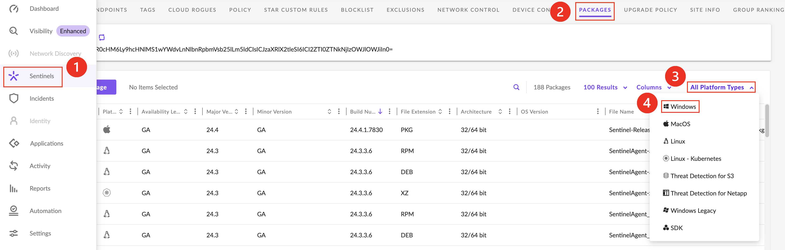
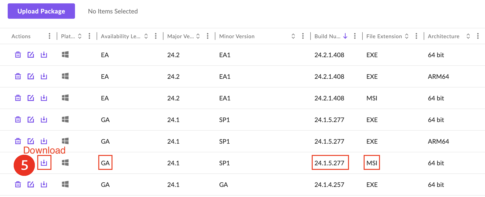
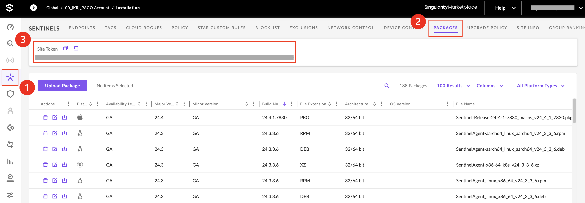
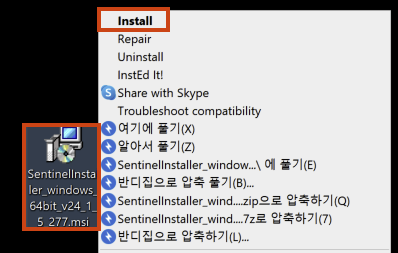
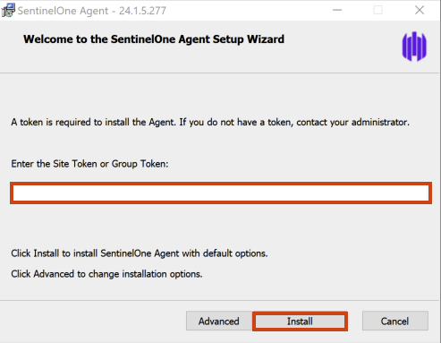
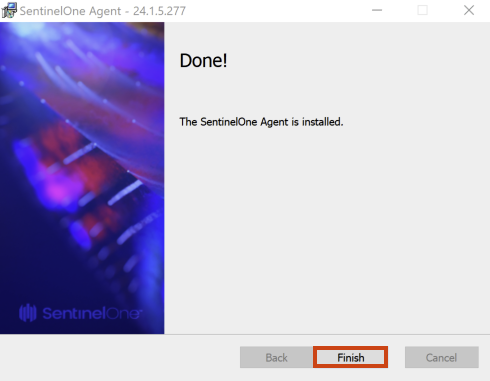
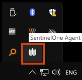
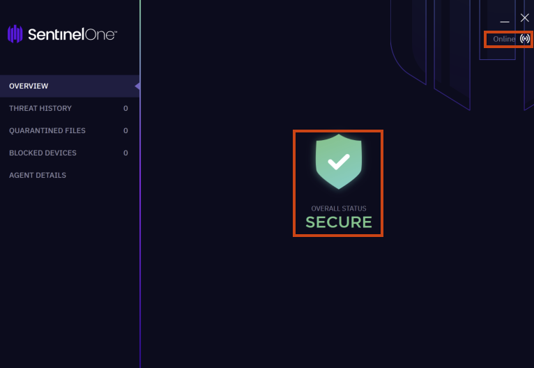
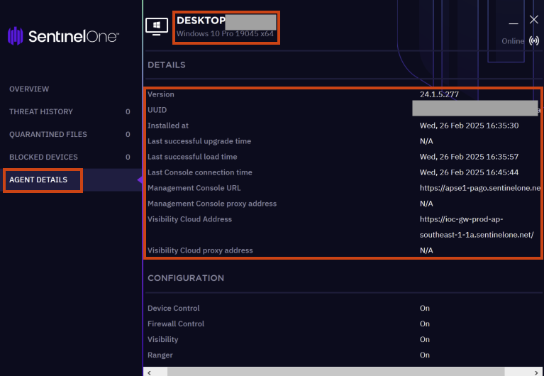

import React from 'react';
import html2pdf from 'html2pdf.js';

<button className="pdf-download-btn" onClick={() => {
  const element = document.getElementById('pdf-content');

  const opt = {
    margin: 0.5,
    filename: 'windows-agent-uninstall-guide.pdf',
    image: { type: 'jpeg', quality: 0.98 },
    html2canvas: { scale: 2 },
    jsPDF: { unit: 'in', format: 'a4', orientation: 'portrait' }
  };

  html2pdf().from(element).set(opt).save();
}}>
  📄 PDF 다운로드
</button>

# Windows 에이전트 설치
---

## 1.  Windows 에이전트 요구 사항
| Group | Windows OS | Agent Version |
|-------|------------|---------------|
| A     | Windows 11/11 23H2/11 24H2 64-bit   Windows 10 64-bit   Windows 8.1 64-bit   Windows Server IoT 2019/2022/2025   Server/Server Core 2025   Server/Storage Server/Server Core 2022 64-bit   Server/Server Core 2019 64-bit   Server/Storage Server/Server Core 2016 64-bit   Server/Storage Server 2012 R2 64-bit | 24.x 이상 23.x 이하
| B     | Windows 10 32-bit   Windows 8.1 32-bit   Windows 8 32/64-bit   Windows 7 SP1 32/64-bit   POSReady 7   Server/Storage Server/Server Core 2012 (not R2) 32/64-bit   Server 2008 R2 SP1 32/64-bit | 23.x 이하

*그룹 A 설치 파일은 64비트 아키텍처만 사용합니다. 32비트 아키텍처를 사용하는 경우 에이전트 설치가 불가능합니다.* 

각 Windows OS 그룹과 에이전트 설치 프로그램 호환성을 확인하십시오.
| **에이전트 버전**  | **Windows OS(최신)** | **Windows OS(레거시 플러스)** |
|------------------|:--------:|:--------:|
| 버전 24.1 이상    |    O 64비트만 가능    |    X     |
| 버전 23.x 및 이전 버전  |    O 64비트만 가능     |    O 32 또는 64비트     |
 
 

## 2. 운영 체제별 필수 Microsoft 보안 업데이트
| Windows OS | 필수 Microsoft 보안 업데이트 |
|------------|-------------------------------------|
| Windows 8.1 64-bit    Windows Server/Storage Server 2012 R2 | KB2919442   KB2919355 (KB2932046, KB2959977, KB2937592, KB2938439, KB2934018 포함)  KB3042058 to update the default TLS cipher suites.  
| Windows 8    Windows Server/Storage Server/Server Core 2012 (not R2) | KB3003729   KB3042058 - 기본 TLS 암호화 suite 업데이트 목적
| Windows 7 SP1    Windows Server 2008 R2 SP1    POSReady 7 | KB2533623   KB2758857   KB4457144   KB3042058 - 기본 TLS 암호화 suite 업데이트 목적   KB3140245   KB3020369   KB3033929 (SHA2) - 이 보안 업데이트는 에이전트 설치 파일의 최소 요구 사항을 충족하기위해 설치되어야 합니다.
 
 
 

## 3. Windows 하드웨어 요구 사항
| 최소 | 권장사항 |
|---------|-------------|
| 1 GHz CPU or better    Single-core (에이전트 설치는 가능하지만 성능 문제가 있을 수 있습니다) | Dual-core |
| 1 GB RAM | 4 GB RAM 또는 이상 |
| 2 GB Windows 파티션의 사용 가능한 디스크 공간    VSS 스냅샷 디스크의 10% (각 드라이브) | 10 GB 이상 권장    VSS 스냅샷 디스크의 10% (각 드라이브) |
 
 

## 4. Windows 에이전트 설치 

### 1) 에이전트 설치 파일 다운로드
- **➊ Sentinels**  > **➋ PACKAGES** > **➌ All Platform Types** > **➍ Windows** > **➎ Download**  
 
 - 테스트 및 안정화가 완료된 **GA 버전**으로 다운로드 해주세요.
 - EA 버전은 테스트 전용 에이전트이며 예상치 못한 버그나 문제를 일으킬 수 있습니다.
 - ARM CPU를 사용하는 경우 ARM64 파일을 다운로드하세요.
  

### 2) 설치 토큰 값 확인
- **➊ SENTINELS** > **➋ PACKAGES** > **➌ Site Token** 
   - Site Token 정보를 확인하려면 **최소 Site Scope**을 선택해야 합니다.  
   - ex) Global / 00_(KR)_PAGO Account / **Installation**
 

### 3) Windows용 SentinelOne 에이전트 설치
- **➊ SentinelInstaller.msi** > **➋ 마우스 우클릭** > **➌ 설치**  
 

- **➊ Site Token 입력** > **➋ Install**  
 

- Finish 클릭  
 
 

## 5. 에이전트 설치 상태 확인
- 오른쪽 하단의 SentinelOne 에이전트 트레이 아이콘을 확인합니다. 
 
- 'SECURE' 및 'Online' 상태 확인  
   - *SECURE 또는 Online 상태가 아닌 경우 에이전트 점검이 필요합니다.*
 
 
 
- AGENT 상세정보   
  - *호스트명, 에이전트 버전, 설치 날짜 등 에이전트에 대한 정보를 볼 수 있습니다.*
 
---

<>

  

    <iframe
      loading="lazy"
      className="sl-demo"
      src="https://app.storylane.io/demo/ebr4w9sehdl6?embed=inline"
      name="sl-embed"
      allow="fullscreen"
      allowFullScreen
      style={{
        position: 'absolute',
        top: 0,
        left: 0,
        width: '100%',
        height: '100%',
        border: '1px solid rgba(63,95,172,0.35)',
        boxShadow: '0px 0px 18px rgba(26, 19, 72, 0.15)',
        borderRadius: '10px',
        boxSizing: 'border-box',
      }}
    />
  

</>
