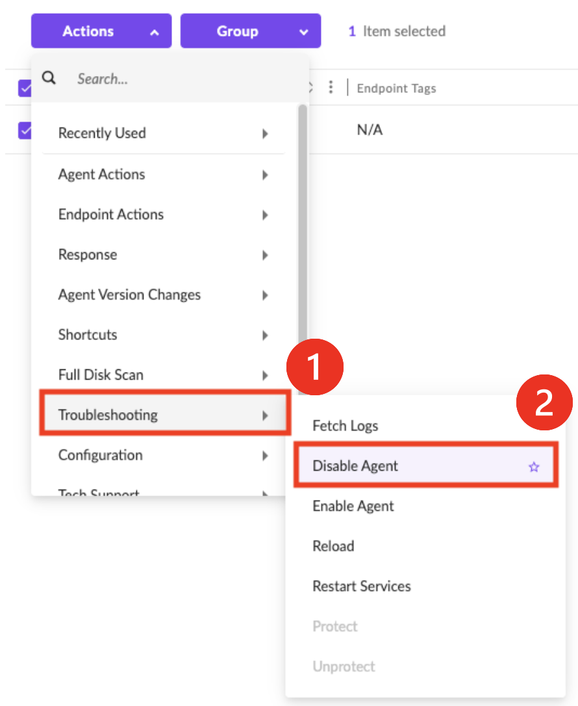
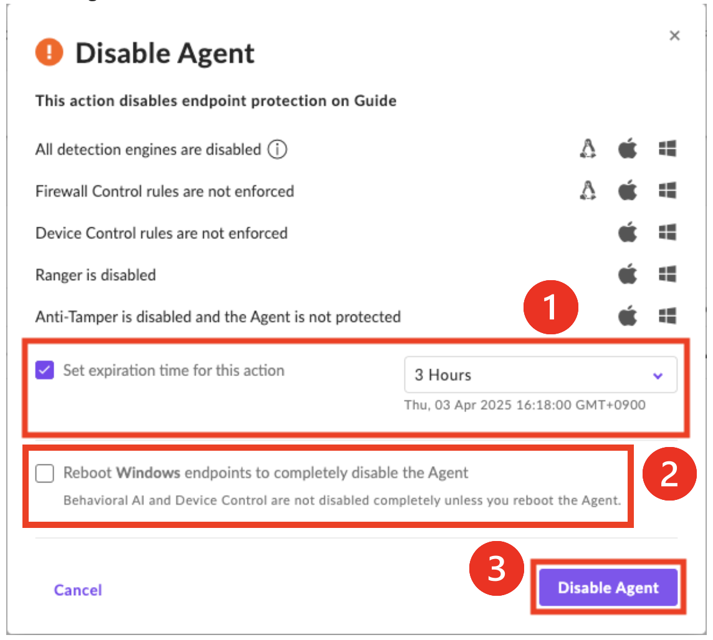
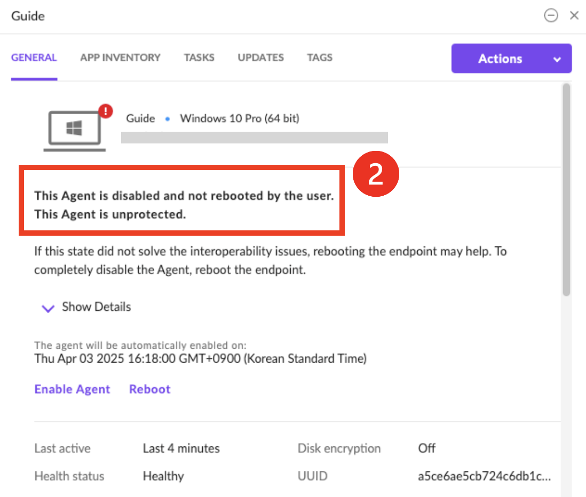
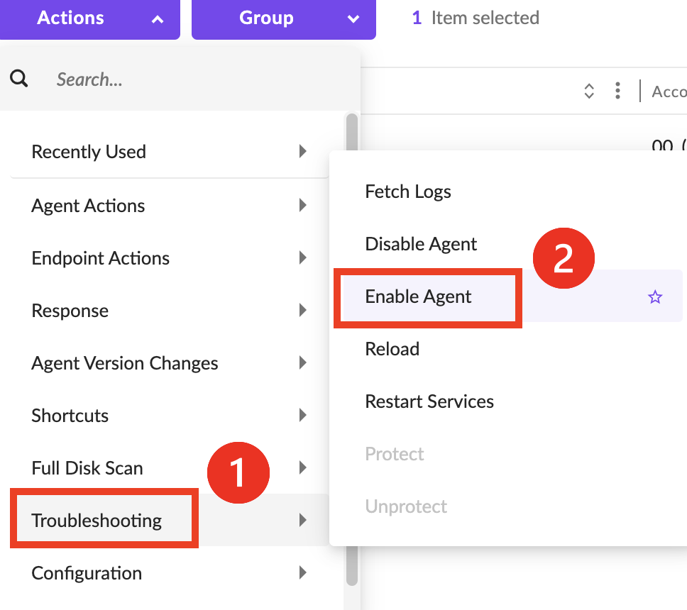
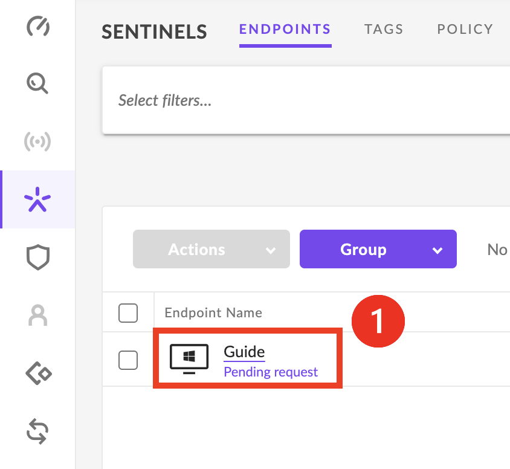
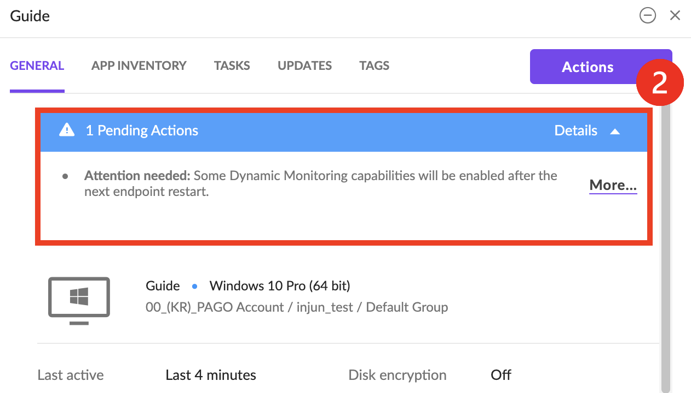

# SentinelOne 에이전트 비활성화 및 활성화
---
:::tip Note
- Agent를 비활성화하면 Agent를 제거하지 않고도 문제를 해결하는데 유용합니다.
- SentinelOne Agent가 엔드포인트에서 기능적 또는 성능적 영향을 미칠 수 있다고 의심되는 경우 Disable Agent를 사용하여 문제가 SentinelOne Agent와 관련이 있는지 확인할 수 있습니다.
- 비활성화 시 보안취약점이 발생하므로, 문제 확인 후 에이전트 활성화가 꼭 필요합니다.
:::
 
## 1. 에이전트 비활성화
- **➊ Sentinels** > **➋ ENDPOINTS** > **➌ 에이전트 선택**  
  

&nbsp;
- **➊ Troubleshooting** > **➋ Disable Agent 실행**  
  

&nbsp;
- **➊ Set expiration time for this action 설정에서 선택한 시간이 지나면 에이전트가 Enable 상태로 자동 전환** 
- **➋ 완전환 비활성화를 위한 윈도우 자동 재부팅 기능** 
- **➌ Disble Agent** 
- **➍ Yes**
- 에이전트 작동 상태는 Operational Status 문서를 확인해주세요. [👉 Agent Operational Status](docs/product-sentinelone/managing-guide/operational-agent-status.md)
&nbsp;

  - Enable 자동 전환 기능과 Reboot Windows 기능은 필요할 경우 사용  
   
   
 

&nbsp;
- **➊ 에이전트가 비활성화 되고 콘솔에서 ❗️ 아이콘 확인**  

&nbsp;
- **➋ 에이전트를 선택하여 디테일한 정보확인**   

&nbsp;
- **➌ AgentUI 에서 NOT SECURE 상태 확인**  
  
 
 

## 2. 에이전트 활성화
- **➊ Sentinels** > **➋ ENDPOINTS** > **➌ 에이전트** 선택 > **➍ Actions** 선택  

&nbsp;
- **➊ Troubleshooting** > **➋ Enable Agent 실행**  
  

&nbsp;
- **➊ 완전환 활성화를 위한 윈도우 자동 재부팅 기능** > **➋ Enable Agent** 
    &nbsp;
  - Reboot Windows 기능은 필요할 경우 사용  
   

&nbsp;
- **➊ 에이전트가 활성화 되고 콘솔에서 확인** 
    - 엔드포인트 재부팅을 진행해야 모든 기능이 완전히 활성화 됩니다. 

&nbsp;
- **➋ 에이전트를 선택하여 디테일한 정보확인**   

&nbsp;
- **➌ AgentUI 에서 SECURE 상태 확인**  

 
---