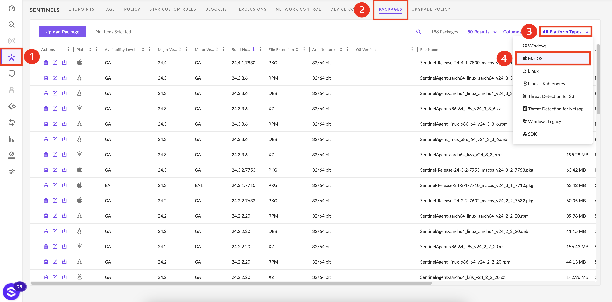
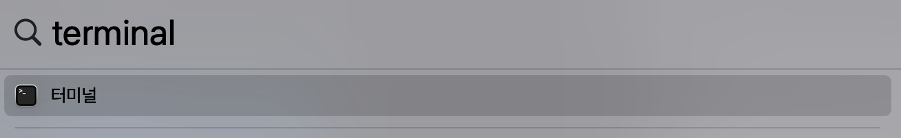
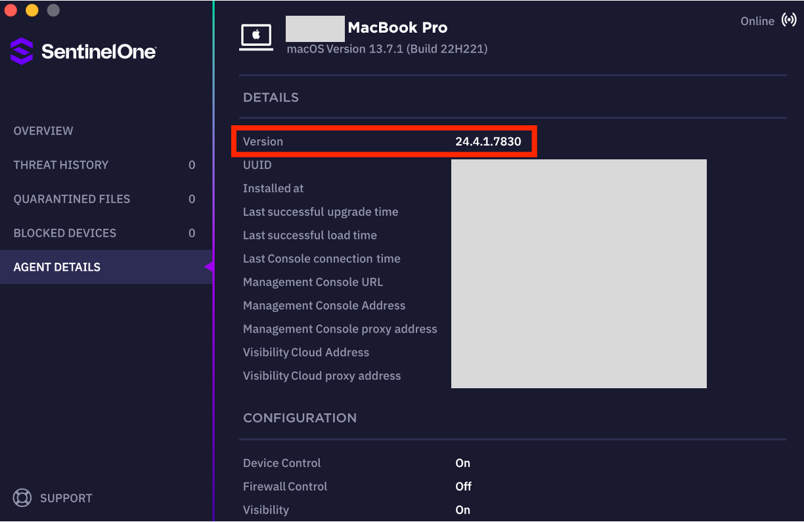

# macOS에서 SentinelOne Agent 업그레이드하는 방법
---

## 명령어를 이용한 업그레이드

### 1. 에이전트 설치 파일 다운로드 
- 최신 macOS Agent 버전 PKG를 다운로드 받으십시오.
- 지원하는 OS 확인 및 PKG 다운로드 방법은 에이전트 설치 가이드를 참고하십시오.<br />[👉 macOS 설치 가이드](/docs/product-sentinelone/deployment-guide/installation/K-macos-installation)
<br />
<br />
<!-- - **➊ Sentinels** > **➋ Packages** > **➌ All Platform Types** > **➍ MacOS**<br /><br />

    - 테스트 및 안정화가 완료된 **GA 버전**으로 다운로드 해주세요. -->

### 2. 터미널 어플리케이션 실행
- 터미널 어플리케이션을 실행하십시오.

<br />
<br />

### 3. 업그레이드 명령어 실행
- <span class = "text-red">*`sentinelctl upgrade-pkg <pkg_file_name>`*</span> 를 실행하십시오.
  ```js
  [root@localhost SentinelOne]$ sudo sentinelctl upgrade-pkg Sentinel-Release-24-4-1-7830_macos_v24_4_1_7830.pkg
  ```
<br />
<br />

### 4. UI 아이콘 확인
- Agent UI에서 변경된 에이전트 버전을 확인하십시오.
<br />
<br />

---