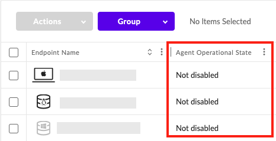
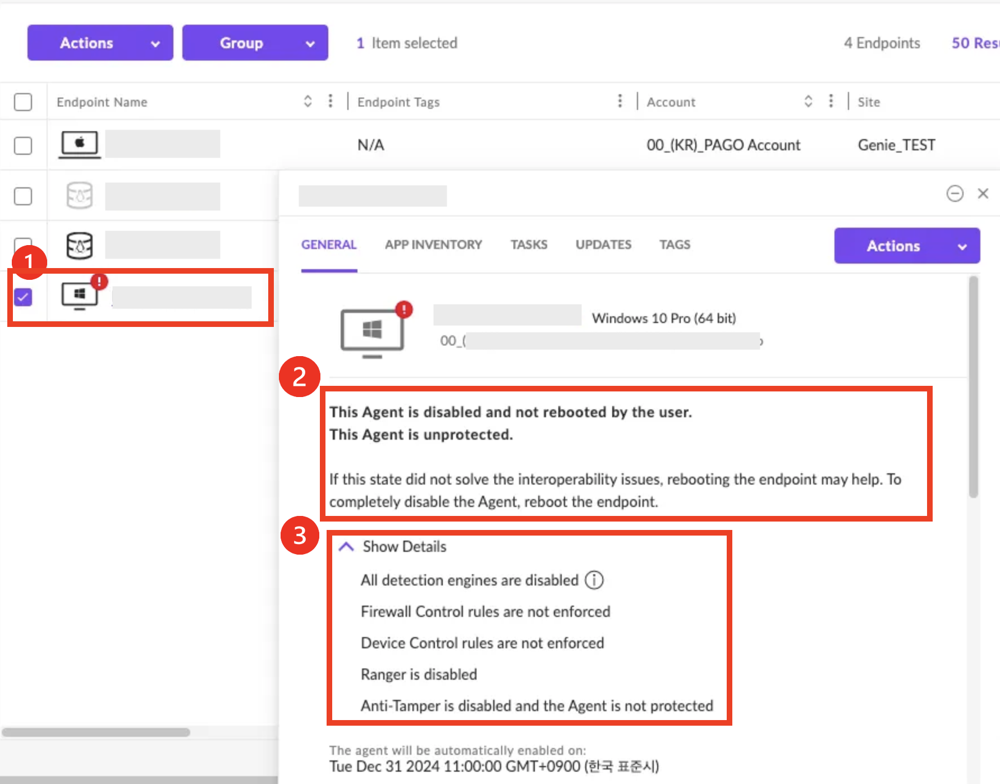

# 에이전트 작동 상태
---
 
*각 에이전트 의 상태는 관리 콘솔에 보고됩니다.*

## 1. 에이전트 작동 상태

<!-- #### • Not disabled[비활성화되지 않음] : 에이전트가 활성화되어 있는 상태입니다. -->

- **Not disabled[비활성화되지 않음]** : 에이전트가 활성화되어 있는 상태입니다.
 

- **Disabled completely by the user[사용자가 완전히 비활성화]** : 재부팅을 완료하여 Agent가 완전히 비활성화되었습니다. 비활성화된 Agent로 인해 엔드포인트는 보호되지 않습니다.
 

- **Disabled and not rebooted by the user[비활성화되고 사용자가 재부팅하지 않음]** : 에이전트가 비활성화되었지만 재부팅을 완료하지 않았습니다. 엔드포인트 재부팅을 하면 에이전트가 완전히 비활성화됩니다.
 

- **Agent disable error[에이전트 비활성화 오류]** : 로그를 가져와서 SentinelOne 지원팀에 도움을 받으십시오.
 

<!-- #### • Disabled completely by the user[사용자가 완전히 비활성화] : 재부팅을 완료하여 Agent가 완전히 비활성화되었습니다. 비활성화된 Agent로 인해 엔드포인트는 보호되지 않습니다. -->

<!-- #### • Disabled and not rebooted by the user[비활성화되고 사용자가 재부팅하지 않음] : 에이전트가 비활성화되었지만 재부팅을 완료하지 않았습니다. 엔드포인트 재부팅을 하면 에이전트가 완전히 비활성화됩니다. -->

<!-- - **Agent disable error[에이전트 비활성화 오류] :로그를 가져와서 SentinelOne 지원팀에 도움을 받으십시오. -->

- **Disabled by SentinelOne[SentinelOne 에서 비활성화]** : 지속적인 오류로 인해 SentinelOne에서 에이전트를 비활성화했습니다. 일반적으로 엔드포인트에 사용 가능한 리소스가 없을 때 발생합니다. 리소스를 해제하고 엔드포인트를 재부팅한 다음 에이전트를 활성화하십시오.
 

- **Limited functionality: Agent database corrupted[제한된 기능: 에이전트 데이터베이스 손상]** : 지속적인 데이터베이스 오류로 인해 SentinelOne에서 에이전트 보안 기능을 비활성화했습니다.
 
 

## 2. 에이전트의 작동상태는 콘솔에서 확인 가능합니다.

- **➊ 엔드포인트 선택** > **➋ Endpoint Detail 창에서 작동 상태 메시지 확인** > **➌ 세부 정보 확인** 
 
---