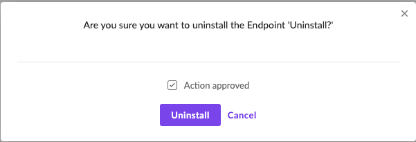
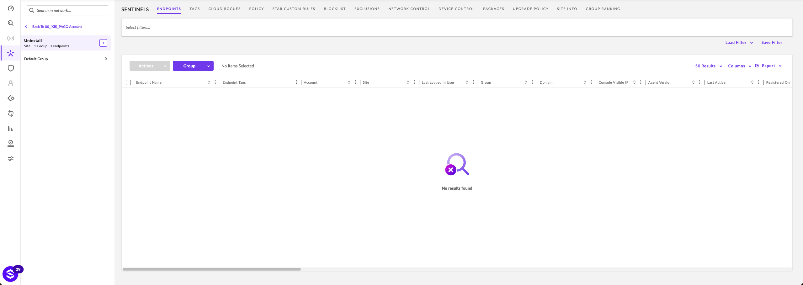

# 콘솔에서 SentinelOne Agent 삭제하는 방법
---
 
> 관리 콘솔 제거 권한이 있는 사용자만 Agent를 제거할 수 있습니다 . 요청에 응답하기 전에 사용자의 이유를 철저히 이해하는 것이 중요합니다.  

 

## 1. 관리 콘솔에서 에이전트 제거
- **하나 이상의 엔드포인트를 선택합니다.**
  - **➊ SENTINELS** > **➋ ENDPOINTS** > **➌ 엔드포인트 선택**   

  &nbsp;
- **선택한 엔드포인트에서 에이전트를 제거하십시오.**
  - **➊ Actions** > **➋ Endpoint Actions** > **➌ Uninstall**.  

  &nbsp;
- **Acion approved를 선택하고 Uninstall을 진행하십시오.**  

  &nbsp;
- 2단계 인증(2FA)을 완료하여 콘솔에서 에이전트를 제거하십시오. 인증은 30분 동안 유효하며, 다시 작업을 수행하려면 재인증이 필요합니다.  

&nbsp;
- 에이전트가 정상적으로 제거됐는지 관리 콘솔에서 확인하십시오.  

 

---