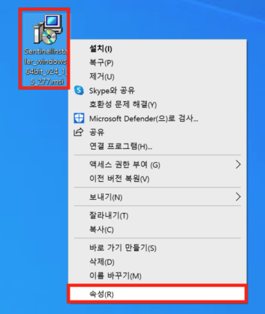
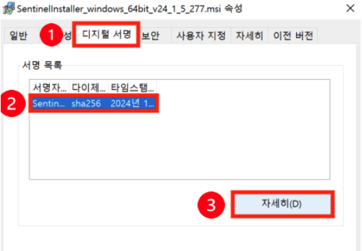
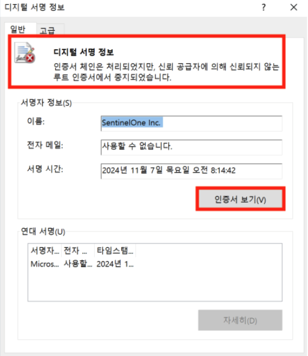
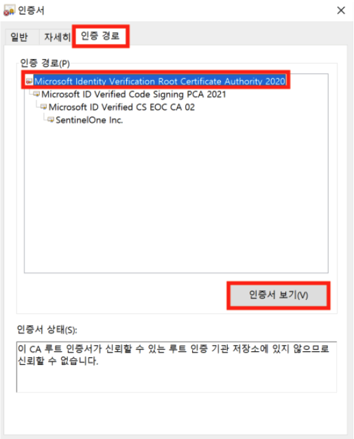
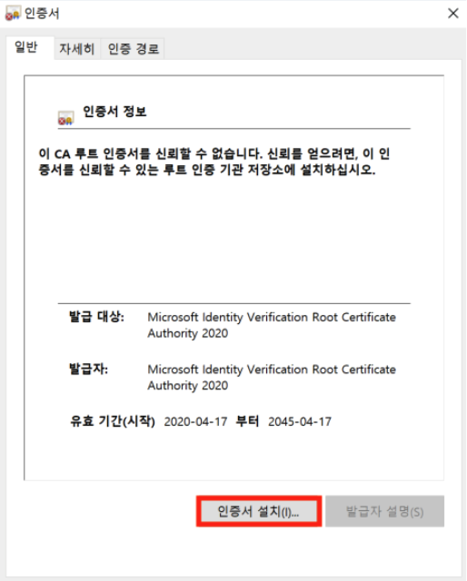
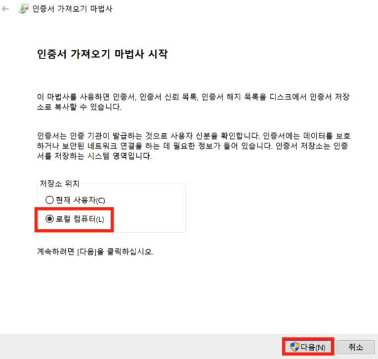
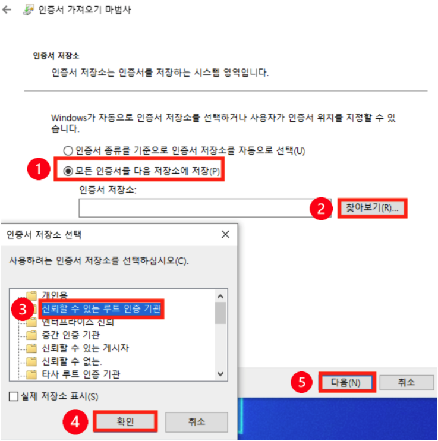
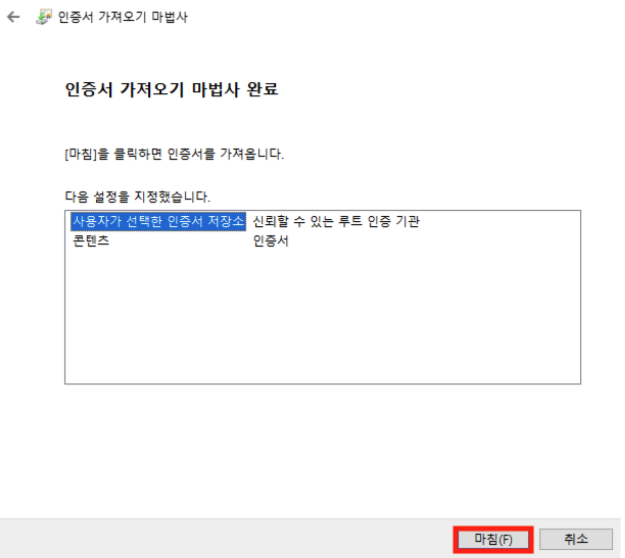
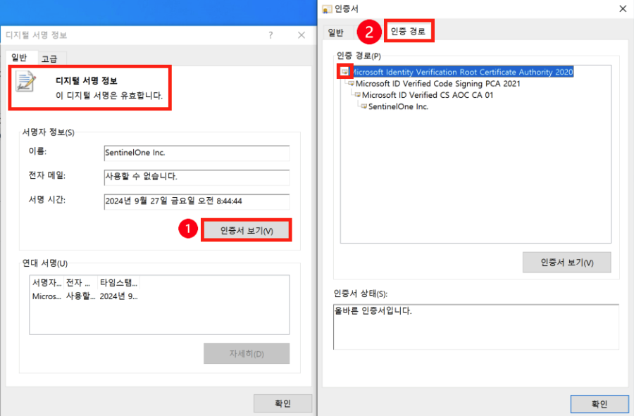

# SentinelOne 필수 경로 인증서 미설치 오류
---
>  SentinelOne Agent를 설치하기 위해서는 설치 파일에 있는 필수 경로 인증서(Microsoft Identity Verification Root Certificate Authority 2020)가 정상적으로 설치 되어 있어야 합니다.  

## 인증서 설치 여부 확인
 

### 1) Agnet 설치 파일 속성 
- 에이전트 설치 파일 내 MS 인증서 및 SentinelOne 인증서 설치 여부를 확인하십시오.  
    - 에이전트 설치 파일 우클릭 > **[속성]** 실행  &nbsp;
 

### 2) 디지털 서명 내 인증서 확인
- **➊ [디지털 서명]** > **➋ [인증서] 선택** > **➌ [자세히]** 실행   &nbsp;
- **디지털 서명 정보 ❌** 확인 > **[인증서 보기]** (디지털 서명 정보가 유효하다 표시된다면 인증서 문제가 아닙니다.)   &nbsp;
    - **[인증 경로]** > **최상단 인증서 선택** > **[인증서 보기]**   &nbsp;
 

### 3) 인증서 설치 진행
- 인증서 설치 진행  

&nbsp;
- 인증서 가져오기 진행 > **[로컬 컴퓨터]** 선택 > **[다음]**  

&nbsp;
- **➊ [모든 인증서를 다음 저장소에 저장]** > **➋ [찾아보기]** > **➌[신뢰할 수 있는 루트 인증 기관 선택]** > **➍ [확인]** > **➎[다음]**  

&nbsp;
- **[마침]** 선택   

&nbsp;
- 속성 창을 모두 닫고 다시 실행하여 **디지털 서명 정보 : 유효합니다** 확인 > **➊ [인증서 보기]** > **➋ [인증경로]** > **최상단 인증서 아이콘 확인**  &nbsp;

 
---