# 오프라인 에이전트 및 통신 문제 해결
---

## 1. 443 포트 통신 여부 확인

443 포트가 방화벽에서 열려 있는지 확인하기 위해 Telnet 명령어로 통신 가능 여부를 테스트합니다.
- `telnet <your_console.sentinelone.net> 443` 명령어를 실행하여 443 포트를 통해 에이전트와 콘솔 간 통신 확인하십시오. 
  - telnet apse1-pago.sentinelone.net 443
  - telnet ioc-gw-prod-ap-southeast-1-1a.sentinelone.net 443
  - telnet ioc-gw-prod-ap-southeast-1-1b.sentinelone.net 443
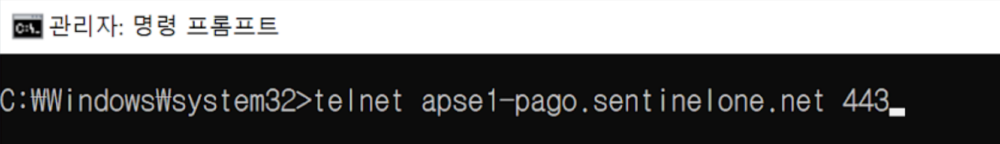  

***참고사항 : telnet client 미설치 시 설치가 필요합니다.***

<!-- ## 1. 네트워크 연결 테스트
- `ping <your_console.sentinelone.net>` 명령어를 통해 URL 주소가 네트워크에서 정상적으로 응답하는지 확인하십시오.
     - `ping <your_console.sentinelone.net>` 명령어를 통해 URL 주소가 네트워크에서 정상적으로 응답하는지 확인하십시오.
     - IP 주소로 반환되면 ping 성공 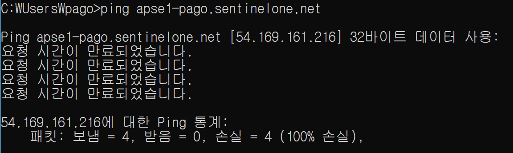  

- `telnet <your_console.sentinelone.net> 443` 명령어를 실행하여 443 포트를 통해 에이전트와 콘솔 간 통신 확인하십시오.   *텔넷이 설치 되지 않으면 새 창이 뜨지 않습니다. 텔넷 클라이언트를 설치하십시오.*
   
     - **텔넷 클라이언트 설치**
       - **[제어판]** > **[프로그램 및 기능]** 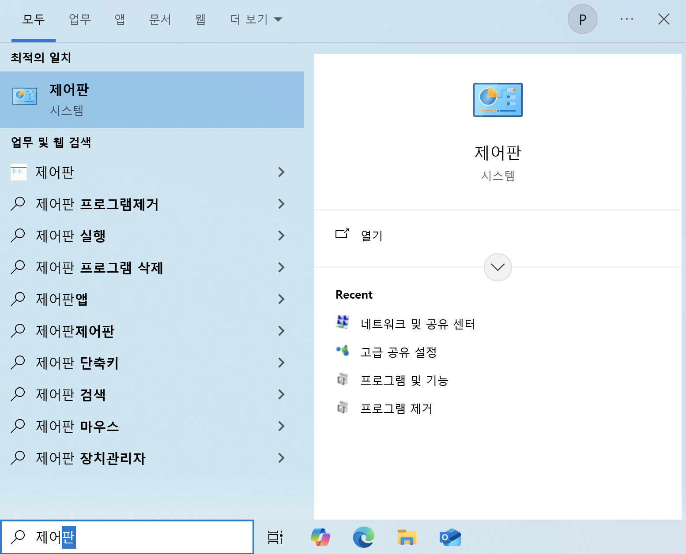 &nbsp;     
       - &nbsp; **1) Windows 기능 켜기/끄기** > **2) 텔넷 클라이언트** > **3) 확인**을 눌러 텔넷 클라이언트 설치 진행. 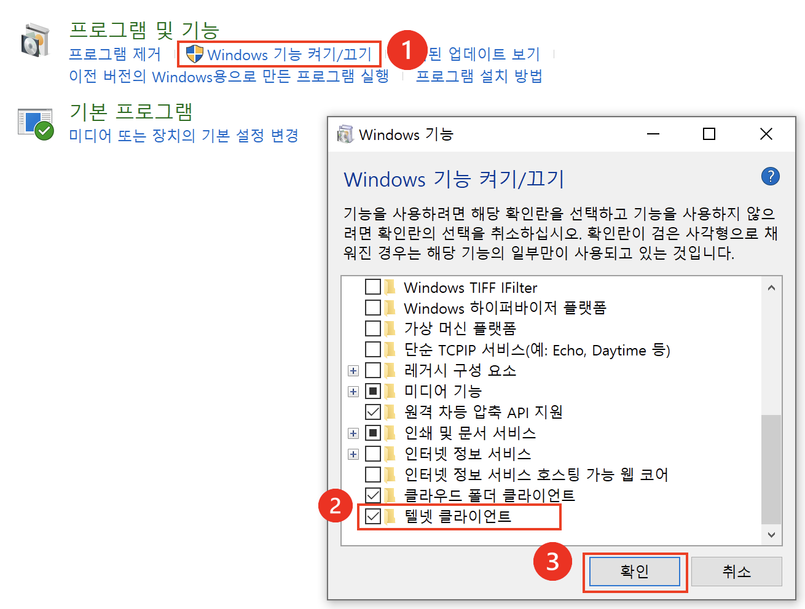 
 
  -->

## 2. SSL/TLS 통신 불가
운영 체제별로 SSL/TLS 보안 통신을 지원하기 위해 필수 Microsoft 보안 업데이트가 필요합니다.
- 운영 체제별 필수 Microsoft 보안 업데이트 
  **보안 업데이트 후 적용을 위해 재부팅이 필요합니다.**
  | **Windows OS**  | **Required Microsoft security updates** |
  |-------------------------------|--------|
  | Windows Server 2008 R2 SP1  Windows 7 SP1   |   KB2758857 KB4457144 KB4490628 KB3140245 KB2864202 KB3020369 KB5022661 KB3033929     |
  | Windows Server/Storage Server/Server Core 2012 (not R2)   |   KB2758857 KB4457144 KB4490628 KB3140245 KB2864202 KB3020369 KB5022661 KB3033929     | 
  | Windows Server/Storage Server 2012 R2   |   KB2758857 KB4457144 KB4490628 KB3140245 KB2864202 KB3020369 KB5022661 KB3033929     |
 

- systeminfo 명령어를 사용하여 설치된 핫픽스를 확인하십시오.
  - `systeminfo | findstr KB3032058`

   <!-- - 에이전트 서비스가 실행 중인지 확인합니다.
       - **window + R 실행** > **`services.msc`** 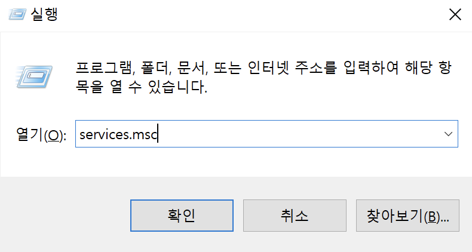 &nbsp;
       - **Sentinel Agent**의 상태가 **실행중**인지 확인 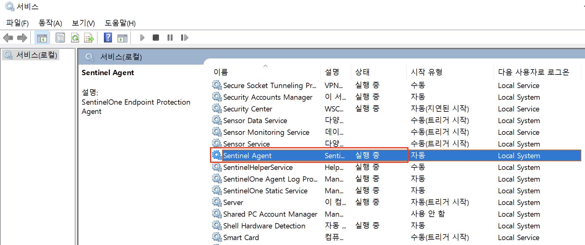 &nbsp;
   - 작업관리자에서 실행 중인 프로세스 확인
     - **window + R 실행** > **`taskmgr`**
     - 해당 프로세스가 실행 중인지 확인 -->

 
 

<!-- ## 3. SentinelCtl 사용하기
- 에이전트 서비스 상태와 정책 기본 사항을 확인합니다.
  - `cd  "C:\Program Files\ SentinelOne \Sentinel Agent < 최신 설치 버전 >"` 명령어를 실행하십시오.
  - `SentinelCtl.exe status`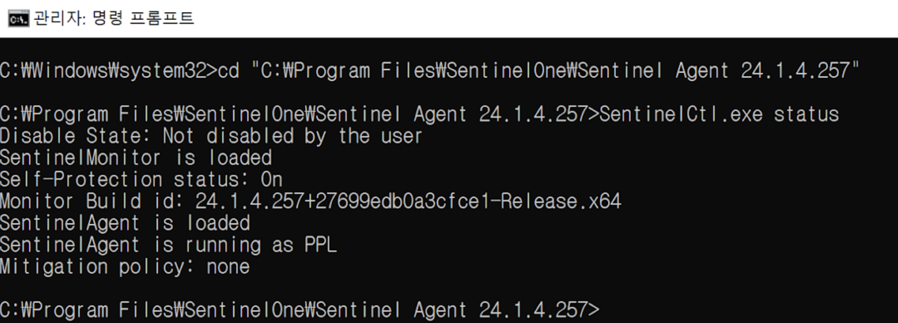  *출력값에서 에이전트가 loaded 및 running이 표시되는지 확인* &nbsp;
     - `bind` 명령어를 사용하여 에이전트를 사이트에 재연결합니다.
       - `SentinelCtl.exe config server.mgmtServer` `SentinelCtl.exe config server.site` 명령어 실행하여 출력값을 확인.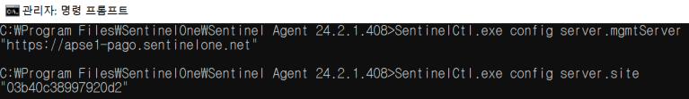
       - *SentinelCtl.exe config server.mgmtServer 해당 명령어는 에이전트에서 관리 콘솔의 URL을 확인하는 명령어* *SentinelCtl.exe config server.site 해당 명령어는 에이전트에서 사이트의 설정 정보를 확인하는 명령어*
       - *두 값 중 하나 또는 둘 다 비어 있는 경우 `bind`명령어를 실행하여 에이전트를 사이트에 다시 연결합니다.*  `SentinelCtl.exe bind <stie_token> -k "passphrase"` 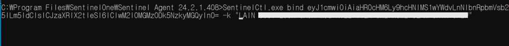 &nbsp;
     - 에이전트의 Anti-tamper 기능을 실행/중지 합니다.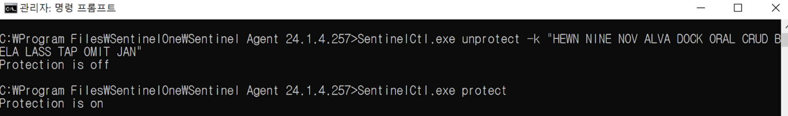
       - `SentinelCtl.exe unprotect -k "passphrase"` 명령어를 실행하여 Anti-tamper 중지
       - `SentinelCtl.exe protect` 명령어를 실행하여 Anti-tamper 실행 &nbsp;
- 에이전트의 서비스를 실행/중지 합니다.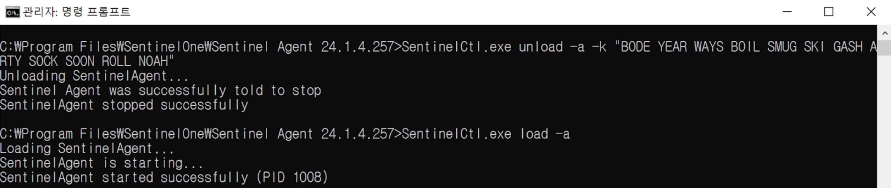
  - `SentinelCtl.exe unload -a -k "passphrase"` 명령어를 실행하여 서비스 중지하십시오.
  - `SentinelCtl.exe unload -a` 명령어를 실행하여 서비스 실행하십시오.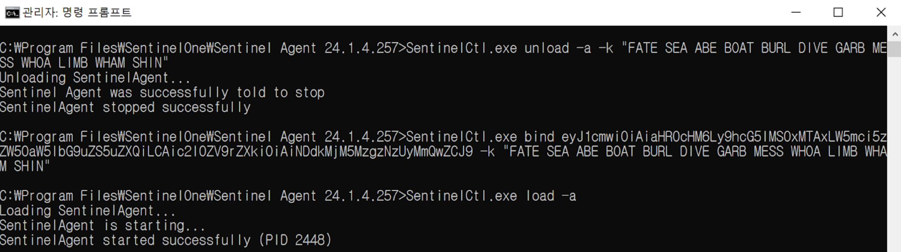 -->
