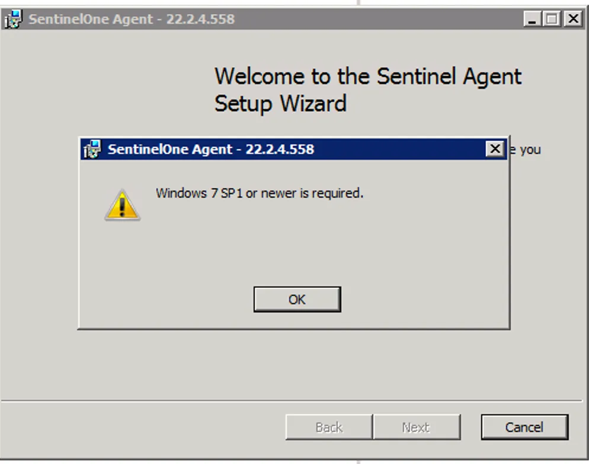
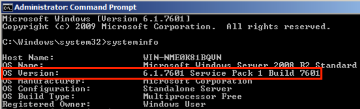
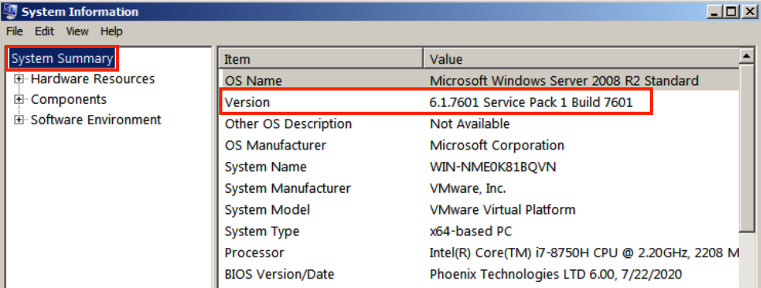
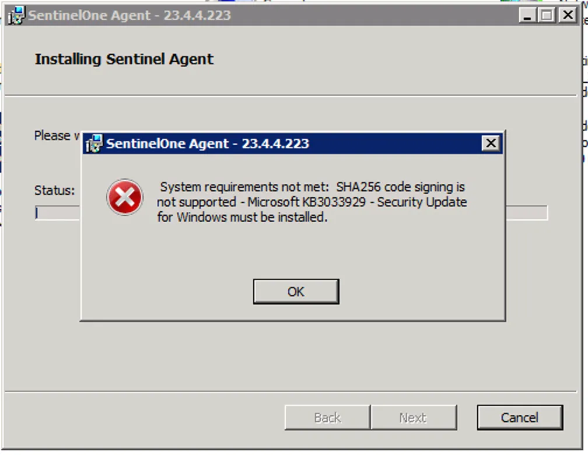
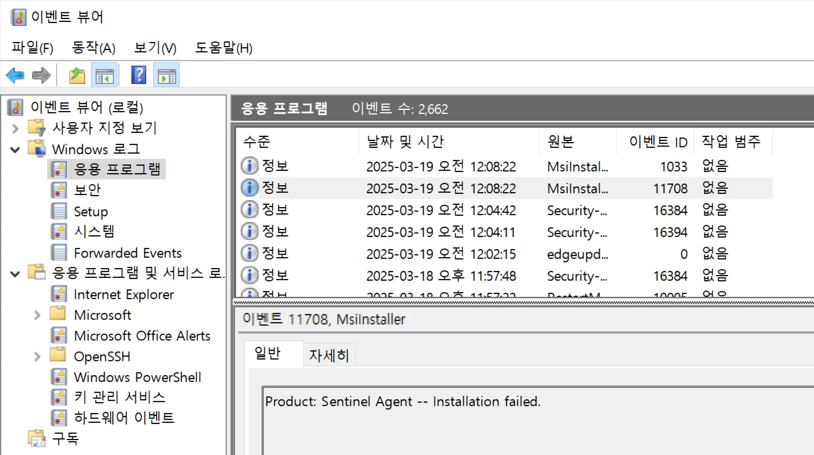

# Windows 에이전트 설치 실패
---
<!-- 1. Windows 에이전트 설치 로그 확인: Windows 에이전트의 설치 로그를 검토하여 설치 과정에서 발생한 문제를 확인합니다.
2. 응용 프로그램 이벤트 로그에서 Windows 설치 프로그램 이벤트 로그 확인: Windows 설치 프로그램(Windows Installer)과 관련된 이벤트 로그를 응용 프로그램 이벤트 로그에서 찾아 검토합니다.
3. 설치 또는 업그레이드 시 SentinelOne 에이전트 로그와의 연관성 확인: SentinelOne 에이전트 설치나 업그레이드 시점에서 기록된 로그와 문제 발생 시점을 비교하여 연관성을 확인합니다. -->

<!-- ## Supported Operating Systems
 -->

<!-- ## 1. Legacy OS 설치 실패 -->

*Windows Server 2008 R2 설치 실패*
<!-- 
### 1) SP1(서비스팩1) 미설치 오류
- SP1(서비스팩1)이 설치되지 않아 발생하는 오류로, SP1 설치를 진행하십시오.  &nbsp;
  - cmd에서 확인
    - **cmd 관리자 권한 실행** > `systeminfo` 명령어를 실행하여 OS 버전을 확인하십시오.  &nbsp;
  - 검색창에 시스템 정보 또는 system information 입력.   -->

&nbsp;

## 1. 보안 업데이트 이슈(핫픽스) 
<!--  -->
*보안 업데이트 설치 후 재부팅 필요합니다.해당 핫픽스 미설치 시 에이전트 설치가 불가합니다.*
    - 설치에 필요한 필수 핫픽스 목록
      - `systeminfo | findstr <Hotfix ID>` 명령어를 입력하여 해당 핫픽스 설치 유무 확인하십시오.
      - KB2758857
      - KB4457144
      - KB4490628
      - KB3042058
      - KB3140245
      - KB2864202
      - KB3020369
      - KB5022661
      - KB3033929(SHA2)
 

## 2. Windows OS 내 에이전트 설치 실패

<!-- *에이전트 설치 진행 중 롤백 현상이 일어나는 경우를 확인하십시오.* -->

<!-- - Check the error messages in the **Windows Event Viewer**  &nbsp;
  -  -->

 
>  SentinelOne Agent를 설치하기 위해서는 설치 파일에 있는 필수 경로 인증서(Microsoft Identity Verification Root Certificate Authority 2020)가 정상적으로 설치 되어 있어야 합니다.  

- 에이전트 설치 파일 내 MS 인증서 및 SentinelOne 인증서 설치 여부를 확인하십시오.  
    - 에이전트 설치 파일 우클릭 > **[속성]** 실행  &nbsp;
    - **➊ [디지털 서명]** > **➋ [인증서] 선택** > **➌ [자세히]** 실행   &nbsp;
    - **디지털 서명 정보 ❌** 확인 > **[인증서 보기]** (디지털 서명 정보가 유효하다 표시된다면 인증서 문제가 아닙니다.)   &nbsp;
    - **[인증 경로]** > **최상단 인증서 선택** > **[인증서 보기]**   &nbsp;
    - 인증서 설치 진행  &nbsp;
    - 인증서 가져오기 진행 > **[로컬 컴퓨터]** 선택 > **[다음]**  &nbsp;
    - **➊ [모든 인증서를 다음 저장소에 저장]** > **➋ [찾아보기]** > **➌[신뢰할 수 있는 루트 인증 기관 선택]** > **➍ [확인]** > **➎[다음]**  &nbsp;
    - **[마침]** 선택   &nbsp;
    - 속석 창을 모두 닫고 다시 실행하여 **디지털 서명 정보 : 유효합니다** 확인 > **➊ [인증서 보기]** > **➋ [인증경로]** > **최상단 인증서 아이콘 확인**  &nbsp;
