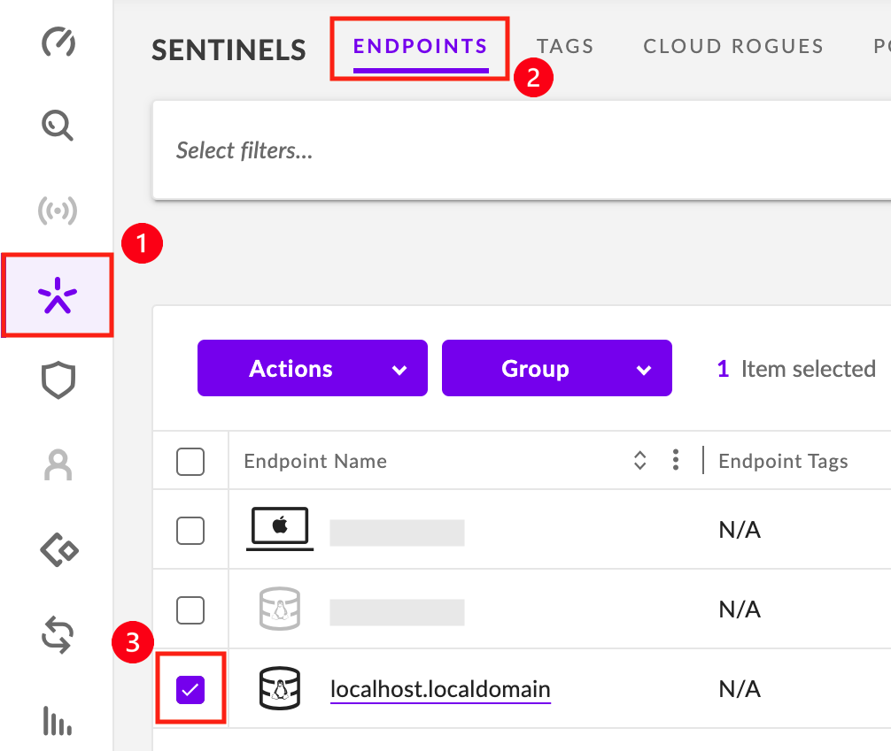
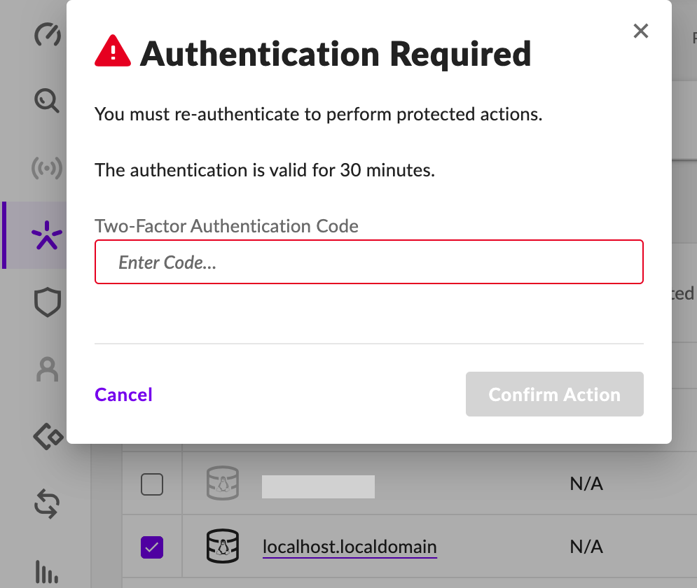
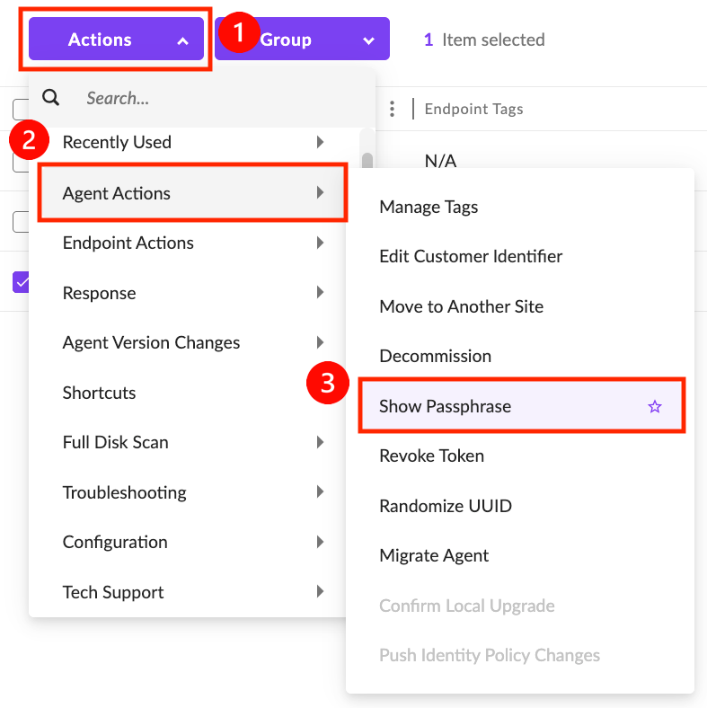
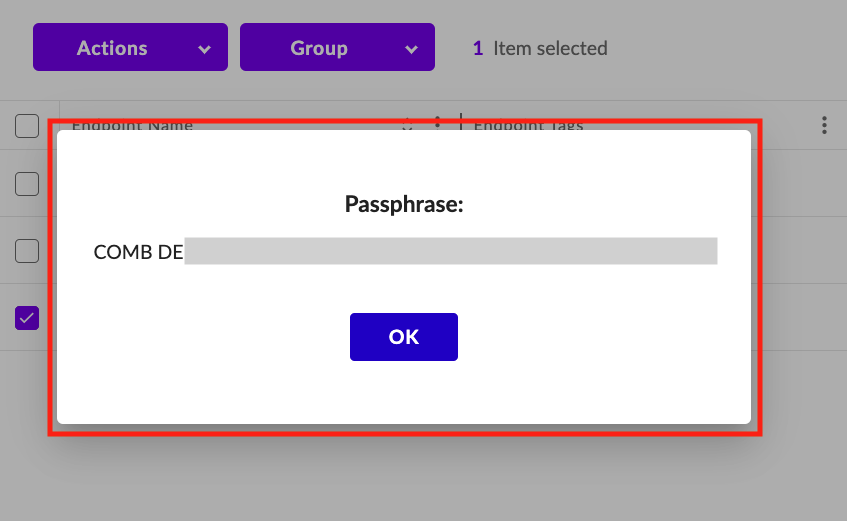

# Linux Agent 삭제
---
<br />
><br />관리 콘솔 제거 권한이 있는 사용자만 Agent를 제거할 수 있습니다 . 요청에 응답하기 전에 사용자의 이유를 철저히 이해하는 것이 중요합니다.<br /><br />
<br />


## 1. 관리 콘솔에서 에이전트 제거 
-  하나 이상의 엔드포인트를 선택합니다.<br />
   -  &nbsp; **1) Sentinels** > **2) ENDPOINTS** > **3) 엔드포인트 선택** <br />

  &nbsp;
- **선택한 엔드포인트에서 에이전트를 제거하십시오.**
   - **1) Actions** > **2) Actions Endpoint** > **3) Uninstall.**<br /><br />

   &nbsp;
- **Acion approved를 선택하고 Uninstall을 진행하십시오.**<br /><br />

   &nbsp;
- 2단계 인증(2FA)을 완료하여 콘솔에서 에이전트를 제거하십시오. 인증은 30분 동안 유효하며, 다시 작업을 수행하려면 재인증이 필요합니다.<br />
<br />

&nbsp;
- 에이전트가 정상적으로 제거됐는지 관리 콘솔에서 확인하십시오.<br /><br />
<br />
<br />

## 2. SentinelCtl을 사용하여 에이전트 제거
***참고:*** *재부팅은 필요하지 않습니다.제거 후 바로 Agent를 다시 설치할 수 있습니다.*
### 1) 엔드포인트의 암호 가져오기
- **삭제할 엔드포인트를 선택합니다.**<br /><br />

&nbsp;
- **➊ Actions** > **➋ Agent Actions** > **➌ Show Passphrase.**<br /><br />
  - **암호를 확인하십시오.** <br /><br />

&nbsp;
### 2) 명령어 실행 및 패스워드 입력
- SentinelCtl 명령어를 사용해 Uninstall 하십시오.<br />
  - 루트 계정으로 로그인하십시오. (sudo 권한만으로 부족합니다).
  - <span class = "text-red">*`/opt/sentinelone/bin/sentinelctl control uninstall`*</span> 를 실행하십시오.
      ```bash
      [root@localhost SentinelOne]$ sudo /opt/sentinelone/bin/sentinelctl control uninstall 
      Enter passphrase : <input_your_passphrase>
      Uninstalling agent...
      Stopping agent...
      Agent stopped
      Successfully uninstalled agent.
      ```
<br />

&nbsp;
- 에이전트가 정상적으로 제거됐는지 관리 콘솔에서 확인하십시오.<br /><br />

---