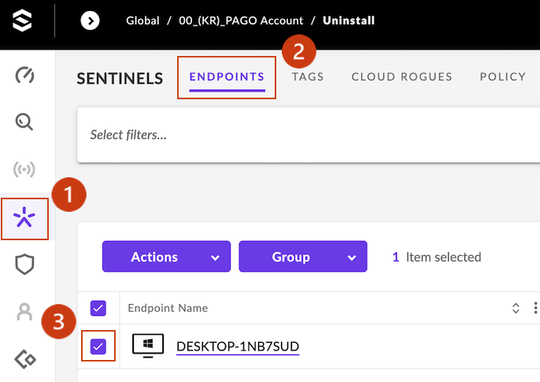
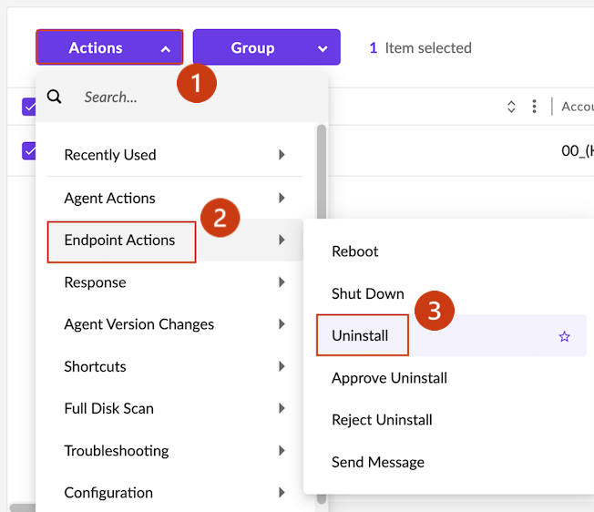
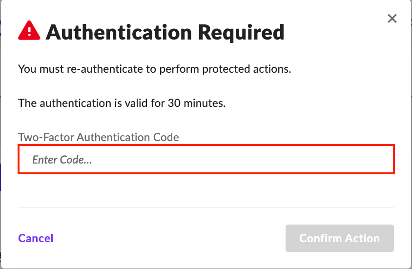
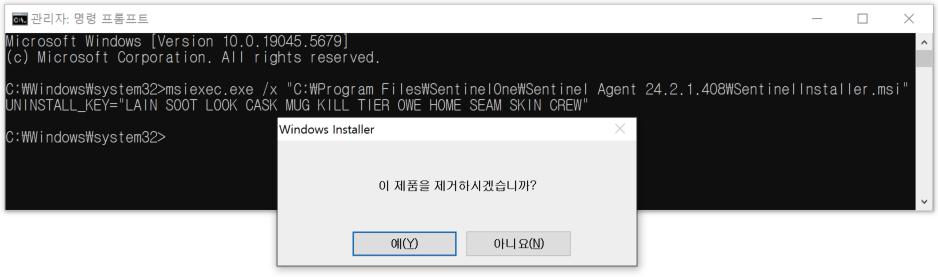
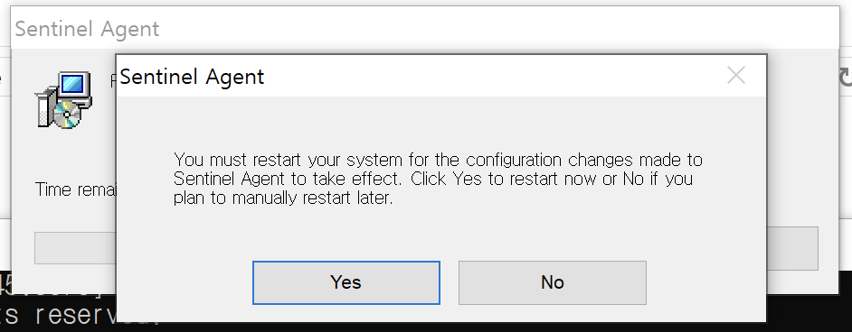

# Windows Agent 삭제
---
<br />
> <br />SentinelOne 에이전트 삭제 시 보안에 취약한 상황이 발생할 수 있습니다. 삭제를 진행하기 전에 삭제하려는 이유를 확인하는 것이 중요합니다.<br /><br />

<br />

## 1. 관리 콘솔에서 에이전트 제거
- **하나 이상의 엔드포인트를 선택합니다.**
  - **➊ SENTINELS** > **➋ ENDPOINTS** > **➌ 엔드포인트 선택** <br /><br />

  &nbsp;
- **선택한 엔드포인트에서 에이전트를 제거하십시오.**
  - **➊ Actions** > **➋ Endpoint Actions** > **➌ Uninstall**.<br /><br />

  &nbsp;
- **Acion approved를 선택하고 Uninstall을 진행하십시오.**<br /><br />

  &nbsp;
-  2단계 인증(2FA)을 완료하여 콘솔에서 에이전트를 제거하십시오. 인증은 30분 동안 유효하며, 다시 작업을 수행하려면 재인증이 필요합니다.<br /><br />

&nbsp;
- 에이전트가 정상적으로 제거됐는지 관리 콘솔에서 확인하십시오.<br /><br />

<br />

## 2. 명령 프롬프트를 사용하여 에이전트 제거
*삭제 후 재부팅이 필요합니다.*
### 1) 엔드포인트의 암호 가져오기
- **삭제할 엔드포인트를 선택합니다.**<br /><br />

&nbsp;
- **➊ Actions** > **➋ Agent Actions** > **➌ Show Passphrase.**<br /><br />

&nbsp;
- **암호를 확인하십시오.** <br /><br />

&nbsp;
### 2) 명령어 실행 및 패스워드 입력
  - 명령 프롬프트를 관리자 권한으로 실행합니다.
    - 다음 명령어로 Uninstall을 실행하십시오.<br /><span class = "text-red">*`msiexec.exe /x "C:\Program Files\SentinelOne\Sentinel Agent <Version>\SentinelInstaller.msi" UNINSTALL_KEY="<passphrase>”`*</span>.<br /><br />
        ```bash
        C:\Windows\system32> msiexec.exe /x "C:\Program Files\SentinelOne\Sentinel Agent 24.1.5.277\SentinelInstaller.msi" UNINSTALL_KEY="DINE VERY BOG TELL BASH OLIN BLOB MARE GURU MET IRK TOP”
        ```
    &nbsp;
    - 명령어 입력 후 나오는 팝업창 '예(Y)' 클릭하십시오.<br />
    &nbsp;
    - 재부팅 팝업창 'Yes' 클릭하십시오.<br />
<br />

&nbsp;
- 에이전트가 정상적으로 제거됐는지 관리 콘솔에서 확인하십시오.<br /><br />

----